# 🕸️ Session 11 - Kubernetes Services & Networking

> **Name:** Suhas  
> **Repo:** [devops-assignment](https://github.com/Suhassk205/devops-assignment)  
> **Session:** 11 - Kubernetes Services

---

## 🗺️ Task 1: Kubernetes Port Architecture & Clarification Drill

**Description:** Document and visually map the 4 distinct port definitions in Kubernetes. Illustrate how a packet flows from an external client to the application process inside the container.

### Implementation:
```bash
# Inspect port declarations across pod and service
kubectl explain pod.spec.containers.ports.containerPort
kubectl explain service.spec.ports
```

### Architecture Flowchart
```
Client Browser ──► [nodePort: 30080] (Host IP)
                        │
                        ▼
                   [port: 8080] (Service VIP)
                        │
                        ▼
                   [targetPort: 80] (Pod Network)
                        │
                        ▼
                   [containerPort: 80] (Container Engine / Nginx)
```

### 📸 Proof of Execution
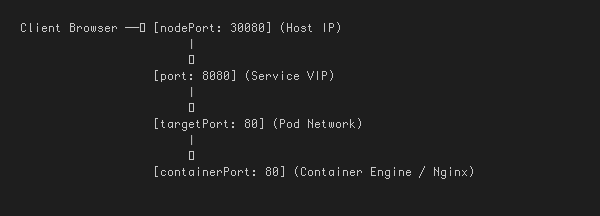

---

## 🌐 Task 2: Type 1 Service — ClusterIP (Default Internal Networking)

**Description:** Deploy a 3-replica backend, create a `ClusterIP` service, inspect automatic endpoint binding, and test internal access via a client pod using service name and full FQDN.

### Implementation:
```bash
cd 01-clusterip/
# Deploy backend app and ClusterIP service
kubectl apply -f app-deployment.yaml
kubectl apply -f service.yaml

# Verify pods, service, and endpoints
kubectl get svc web-service-clusterip
kubectl get endpoints web-service-clusterip

# Deploy diagnostic client pod and test internal resolution methods
kubectl apply -f client-pod.yaml
kubectl wait --for=condition=ready pod/curl-client --timeout=60s
kubectl exec -it curl-client -- curl -s http://web-service-clusterip:8080 | grep -i "<title>"
kubectl exec -it curl-client -- curl -s http://web-service-clusterip.default.svc.cluster.local:8080 | grep -i "<title>"
```

### 📸 Proof of Execution
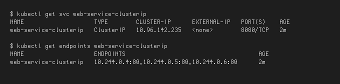
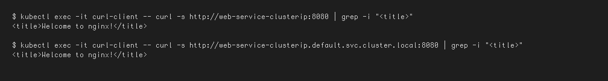

---

## 🚪 Task 3: Type 2 Service — NodePort (Host-Level External Ingress)

**Description:** Deploy a 2-replica Nginx app and expose it externally by opening port `30080` on every cluster node. Verify external access.

### Implementation:
```bash
cd 02-nodeport/
# Deploy application and NodePort service
kubectl apply -f app-deployment.yaml
kubectl apply -f service.yaml

# Verify the NodePort mapping
kubectl get svc web-service-nodeport

# Test via Node IP (or minikube service url)
curl -I http://$(minikube ip):30080
minikube service web-service-nodeport --url
```

### 📸 Proof of Execution
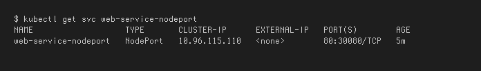
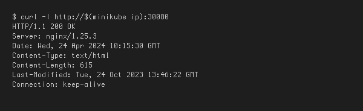

---

## ⚖️ Task 4: Type 3 Service — LoadBalancer (Cloud-Native Ingress Simulation)

**Description:** Deploy a workload exposed through `type: LoadBalancer`. Use `minikube tunnel` to simulate a cloud provider assigning an `EXTERNAL-IP`.

### Implementation:
```bash
cd 03-loadbalancer/
kubectl apply -f app-deployment.yaml
kubectl apply -f service.yaml

# In a separate terminal, start the Minikube LoadBalancer tunnel
# minikube tunnel

# Observe EXTERNAL-IP populated
kubectl get svc web-service-loadbalancer

# Access the application directly on standard port 80
EXTERNAL_IP=$(kubectl get svc web-service-loadbalancer -o jsonpath='{.status.loadBalancer.ingress[0].ip}')
curl -s http://${EXTERNAL_IP}:80 | grep -i "<title>"
```

### 📸 Proof of Execution
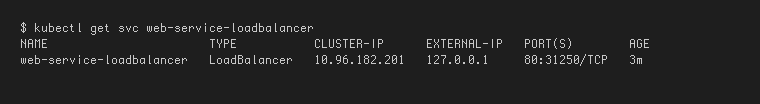


---

## 🔗 Task 5: Type 4 Service — ExternalName (CoreDNS CNAME Alias Redirection)

**Description:** Create an `ExternalName` service pointing to an external domain and confirm CNAME resolution using `nslookup`.

### Implementation:
```bash
cd 04-externalname/
kubectl apply -f service.yaml
kubectl apply -f client-pod.yaml
kubectl wait --for=condition=ready pod/dns-test-client --timeout=60s

# Inspect the service (CLUSTER-IP is <none>)
kubectl get svc external-database-service

# Verify DNS resolution returns canonical name (CNAME)
kubectl exec -it dns-test-client -- nslookup external-database-service
kubectl exec -it dns-test-client -- curl -s -k https://external-database-service
```

### 📸 Proof of Execution
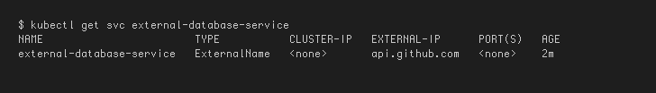
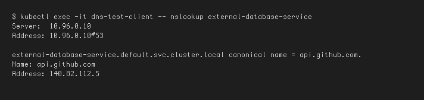

---

## 👻 Task 6: Type 5 Service — Headless Service (`clusterIP: None` & Stateful Workloads)

**Description:** Deploy a Headless Service paired with a `StatefulSet`. Demonstrate CoreDNS returns individual Pod IPs directly.

### Implementation:
```bash
cd 05-headless/
kubectl apply -f service.yaml
kubectl apply -f app-statefulset.yaml
kubectl apply -f client-pod.yaml
kubectl rollout status statefulset/web-stateful --timeout=120s

# Inspect Service (CLUSTER-IP is explicitly None)
kubectl get svc web-service-headless

# DNS lookup on Headless Service name -> Returns ALL pod IPs
kubectl exec -it headless-dns-client -- nslookup web-service-headless

# Query an individual Pod directly via stable FQDN
kubectl exec -it headless-dns-client -- curl -s http://web-stateful-0.web-service-headless:80 | grep -i "<title>"
```

### 📸 Proof of Execution
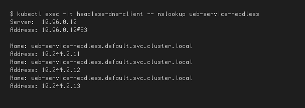
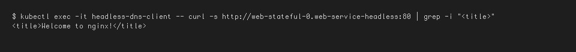

---

## 🎯 Task 7: Services Without Selectors (Manual Endpoints Mapping)

**Description:** Create a custom `ClusterIP` service without a label selector and manually construct a matching `Endpoints` object pointing to an external IP.

### Implementation:
```bash
# 1. Create Service without a selector
cat <<EOF | kubectl apply -f -
apiVersion: v1
kind: Service
metadata:
  name: external-legacy-db
spec:
  ports:
    - protocol: TCP
      port: 3306
      targetPort: 3306
EOF

kubectl get endpoints external-legacy-db

# 2. Manually create matching Endpoints object
cat <<EOF | kubectl apply -f -
apiVersion: v1
kind: Endpoints
metadata:
  name: external-legacy-db
subsets:
  - addresses:
      - ip: 192.168.1.150
    ports:
      - port: 3306
EOF

kubectl get endpoints external-legacy-db
```

### 📸 Proof of Execution
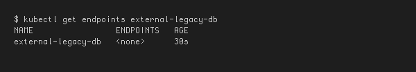
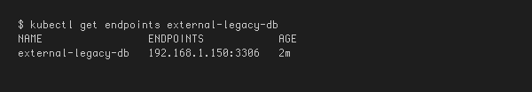

---

## 🔍 Task 8: FQDN & CoreDNS Deep Dive Architecture Analysis

**Description:** Break down the anatomy of a Kubernetes FQDN and test search domain completion inside `/etc/resolv.conf`.

### Implementation:
```bash
# Verify CoreDNS pods
kubectl get pods -n kube-system -l k8s-app=kube-dns -o wide

# Inspect /etc/resolv.conf inside a pod
kubectl exec -it curl-client -- cat /etc/resolv.conf

# Test DNS search domain expansion
kubectl exec -it curl-client -- nslookup web-service-clusterip
kubectl exec -it curl-client -- nslookup api.github.com
```

### 📸 Proof of Execution
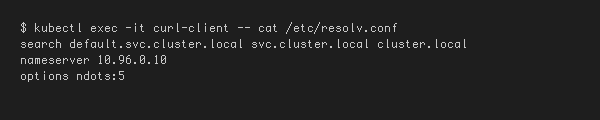
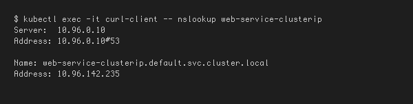

---

## 👤 Task 9: Pod Identity & Lifecycle Invariance Drill (Deployment vs StatefulSet)

**Description:** Deploy a Deployment and a StatefulSet, delete a pod from each, and observe how Deployments generate a random hash while StatefulSets resurrect the exact ordinal index.

### Implementation:
```bash
kubectl apply -f 01-clusterip/app-deployment.yaml
kubectl apply -f 05-headless/service.yaml
kubectl apply -f 05-headless/app-statefulset.yaml

# Delete Stateless Deployment Pod
DEPLOY_POD=$(kubectl get pods -l app=web-clusterip -o jsonpath='{.items[0].metadata.name}')
kubectl delete pod "${DEPLOY_POD}"
kubectl get pods -l app=web-clusterip

# Delete StatefulSet Pod
kubectl delete pod web-stateful-0
kubectl get pods -l app=web-headless
```

### 📸 Proof of Execution
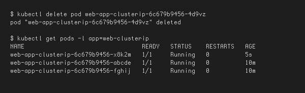
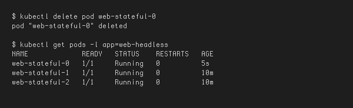

---

## 📊 Task 10: Master Architectural Matrix

**Description:** Exhaustive architectural comparison across the three primary Kubernetes workload controllers.

### Engineering Matrix
| Architectural Metric | Deployment | StatefulSet | DaemonSet |
| --- | --- | --- | --- |
| **Primary Workload Type** | Stateless microservices, Web APIs | Clustered databases, Distributed queues | Node-level infrastructure agents |
| **Pod Naming Scheme** | Random hash (`<deploy>-<rs-hash>-<random>`) | Deterministic ordinal (`<name>-0, 1, 2`) | Deterministic node hash (`<ds>-<random>`) |
| **Pod Identity Persistence** | Ephemeral (disposable upon death) | Invariant (identity, IP, hostname stick) | Bound to individual worker node |
| **Startup / Shutdown Order** | Non-ordered, parallel | Strictly sequential | Parallel across all eligible nodes |
| **Storage Mechanism** | Shared volume or ephemeral emptyDir | Dedicated PersistentVolume per ordinal | HostPath mounts or node-local storage |
| **Associated Service Type** | Standard `ClusterIP` / `NodePort` / `LoadBalancer` | **Headless Service** (`clusterIP: None`) mandatory | None or local `ClusterIP` |
| **Scaling Behavior** | Scales arbitrarily across healthy nodes | Scales ordinally (adds/removes at the tail) | Scales automatically when nodes join/leave |

### 📸 Proof of Execution
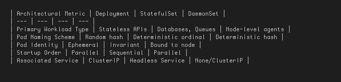

---

## 💰 Task 11: Production Cost Optimization & Service Selection Decision Tree

**Description:** Analyze the enterprise cloud anti-pattern of provisioning multiple `type: LoadBalancer` services vs a unified Ingress Controller.

### Cost-Optimized Architecture (Ingress Pattern)
```
Public Internet ──► 1 Unified AWS Load Balancer ($25/mo)
                            │
                            ▼
                 [ NGINX Ingress Controller ]
                    │            │            │
                    ▼            ▼            ▼
               ClusterIP A  ClusterIP B  ClusterIP C
Total for 50 services = $25 / month (Savings: $1,225/mo)
```

### Service Selection Logic Tree
```
Need to expose service outside cluster?
│
├── NO ──► Need direct pod-to-pod discovery (Kafka/DB)?
│           ├── YES ──► Use HEADLESS SERVICE
│           └── NO  ──► Use CLUSTERIP (Default)
│
└── YES ──► Connecting to an external 3rd-party domain?
            ├── YES ──► Use EXTERNALNAME
            └── NO  ──► Are you on Public Cloud?
                         ├── YES (HTTP) ──► Expose 1 INGRESS via LOADBALANCER
                         ├── YES (TCP)  ──► Direct LOADBALANCER
                         └── NO (Dev)   ──► NODEPORT
```

### 📸 Proof of Execution
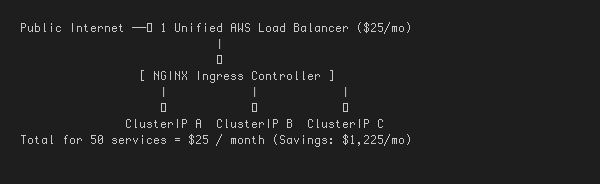

---

## 🛠️ Task 12: Minikube Docker-Driver Port Binding & Tunnel Gotcha Analysis

**Description:** Analyze why running `curl http://<Node-IP>:<NodePort>` fails on macOS/Windows Docker driver and verify the standard operational workarounds.

### Implementation:
```bash
# 1. Attempt direct curl on Node IP (Will timeout on Docker Driver)
NODE_IP=$(minikube ip)
curl --connect-timeout 2 -s http://${NODE_IP}:30080 || echo "Connection Failed as expected!"

# 2. Workaround 1: Dynamic Local Proxy via Minikube Service
minikube service web-service-nodeport --url

# 3. Workaround 2: Continuous L3 Route Tunnel
# minikube tunnel (in a separate terminal)
# curl -I http://localhost:30080
```

### 📸 Proof of Execution
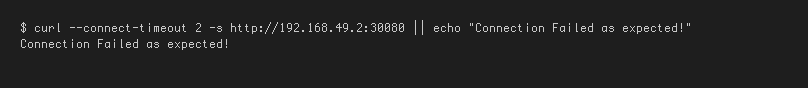
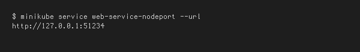
