# 🔐 Session 12 - Ingress, ConfigMaps & Secrets

> **Name:** Suhas  
> **Repo:** [devops-assignment](https://github.com/Suhassk205/devops-assignment)  
> **Session:** 12 - Ingress, ConfigMaps & Secrets

---

## 📄 Task 1: Non-Sensitive Configuration Decoupling via ConfigMaps

**Description:** Create a declarative `ConfigMap` storing application runtime configuration and query keys imperatively.

### Implementation:
```bash
kubectl apply -f 01-configmap/app-config.yaml
kubectl get configmap yatri-app-config
kubectl describe configmap yatri-app-config
kubectl get configmap yatri-app-config -o jsonpath='{.data.ENVIRONMENT}' && echo ""
kubectl get configmap yatri-app-config -o jsonpath='{.data.LOG_LEVEL}' && echo ""
```

### 📸 Proof of Execution
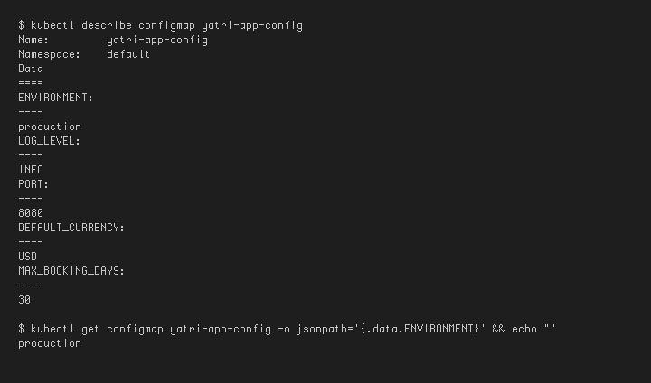

---

## 🔄 Task 2: ConfigMap Live Update & Pod Immobility Verification Drill

**Description:** Dynamically patch an active `ConfigMap`, prove that running pods don't auto-update, and execute a zero-downtime rolling restart to load new values.

### Implementation:
```bash
# Patch ConfigMap
kubectl patch configmap yatri-app-config --type merge -p '{"data":{"ENVIRONMENT":"staging"}}'

# Check running pod env (assuming yatri-backend is running)
kubectl exec -it deploy/yatri-backend -- env | grep ENVIRONMENT

# Trigger rolling restart
kubectl rollout restart deployment/yatri-backend
kubectl rollout status deployment/yatri-backend

# Re-check pod env
kubectl exec -it deploy/yatri-backend -- env | grep ENVIRONMENT

# Revert
kubectl patch configmap yatri-app-config --type merge -p '{"data":{"ENVIRONMENT":"production"}}'
kubectl rollout restart deployment/yatri-backend
```

### 📸 Proof of Execution
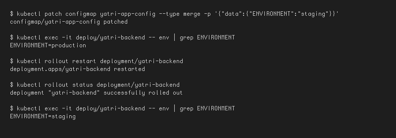

---

## 🛡️ Task 3: Sensitive Data Isolation via Kubernetes Secrets

**Description:** Construct an `Opaque` Kubernetes `Secret` storing database credentials and decode them using Base64.

### Implementation:
```bash
kubectl apply -f 02-secret/db-secret.yaml
kubectl get secret yatri-db-secret
kubectl describe secret yatri-db-secret
kubectl get secret yatri-db-secret -o jsonpath='{.data.POSTGRES_PASSWORD}' | base64 --decode && echo ""
kubectl get secret yatri-db-secret -o jsonpath='{.data.POSTGRES_USER}' | base64 --decode && echo ""
```

### 📸 Proof of Execution
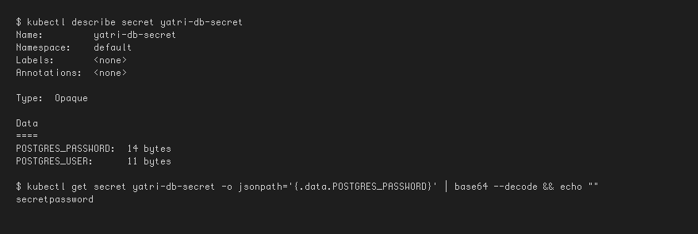

---

## 🐞 Task 4: The Trailing Newline Secret Gotcha

**Description:** Investigate the critical Base64 encoding bug where standard `echo` appends an invisible trailing newline.

### Implementation:
```bash
# Broken pattern: appends 0x0a (\n)
echo "secretpassword" | xxd
echo "secretpassword" | base64

# Correct pattern: exact byte stream
echo -n "secretpassword" | xxd
echo -n "secretpassword" | base64
```

### 📸 Proof of Execution
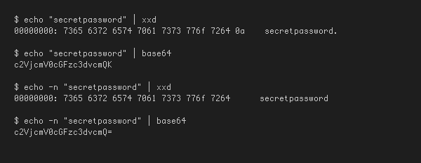

---

## 🏢 Task 5: Enterprise Secret Management & Pipeline Integration Analysis

**Description:** Document the security anti-pattern of hardcoding Base64 secrets in Git and how enterprise architectures resolve this.

### Architectural Summary
- **The Vulnerability:** Hardcoding secrets in YAML manifests exposes them via Git history and general RBAC access. Base64 is merely encoding, easily reversible by anyone reading the file.
- **External Secret Operators:** Enterprises use tools like **External Secrets Operator (ESO)** or **HashiCorp Vault Agent** to sync credentials dynamically from robust vaults (AWS Secrets Manager, Azure Key Vault).
- **CI/CD Integration:** CI/CD pipelines (e.g., GitHub Actions, Azure DevOps) dynamically inject these values via variables at runtime, ensuring no credentials ever persist in the Git repository.

### 📸 Proof of Execution
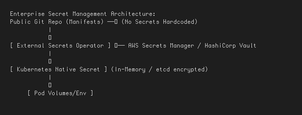

---

## 🧩 Task 6: Combined ConfigMap and Secret Pod Injection Architecture

**Description:** Deploy a backend application that consumes plain-text config and sensitive credentials simultaneously.

### Implementation:
```bash
kubectl apply -f 04-full-demo/configmap.yaml
kubectl apply -f 04-full-demo/secret.yaml
kubectl apply -f 04-full-demo/backend.yaml
kubectl rollout status deployment/yatri-backend

# Verify injection inside pod
kubectl exec -it deploy/yatri-backend -- env | grep -E "ENVIRONMENT|LOG_LEVEL|POSTGRES|DEFAULT_CURRENCY"
```

### 📸 Proof of Execution
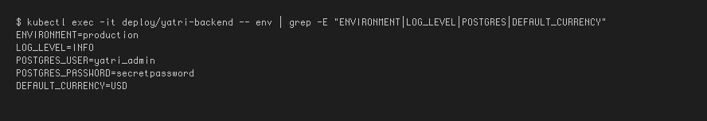

---

## 🏛️ Task 7: Architectural Comparative Study — Ingress Resource vs. Ingress Controller

### Comparison Table
| Component | Responsibility | Action |
| --- | --- | --- |
| **Ingress Resource** | Declarative Layer 7 Routing Rules | Just an API object containing hostnames, paths, and backend service mappings. |
| **Ingress Controller** | Active Reverse Proxy Daemon | Watches the API, generates proxy configurations (e.g., `nginx.conf`), and actually routes real network traffic. |

### 📸 Proof of Execution


---

## 🟢 Task 8: NGINX Ingress Controller Activation

**Description:** Enable the NGINX Ingress Controller addon on Minikube and verify readiness.

### Implementation:
```bash
minikube addons enable ingress
kubectl get pods -n ingress-nginx
kubectl wait --namespace ingress-nginx \
  --for=condition=ready pod \
  --selector=app.kubernetes.io/component=controller \
  --timeout=120s
```

### 📸 Proof of Execution
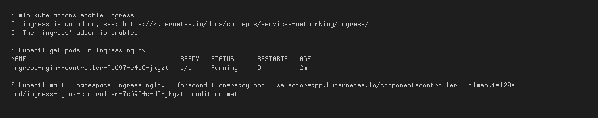

---

## 🗺️ Task 9: Local DNS Resolution & System Hosts File Mapping

**Description:** Map the Minikube cluster IP to a custom domain endpoint (`yatri.local`) inside `/etc/hosts`.

### Implementation:
```bash
MINIKUBE_IP=$(minikube ip)
echo "Minikube IP is: ${MINIKUBE_IP}"

# Append to /etc/hosts
if ! grep -q "yatri.local" /etc/hosts; then
  echo "${MINIKUBE_IP}  yatri.local" | sudo tee -a /etc/hosts
fi
grep "yatri.local" /etc/hosts
```

### 📸 Proof of Execution


---

## 🛣️ Task 10: Layer 7 Path-Based Routing Implementation

**Description:** Direct `/` to a frontend service and `/api/*` to a backend service using an Ingress resource.

### Implementation:
```bash
kubectl apply -f 04-full-demo/frontend.yaml
kubectl apply -f 04-full-demo/backend.yaml
kubectl apply -f 04-full-demo/ingress.yaml

kubectl get ingress yatri-ingress

# Test Frontend path (Root /)
curl -s http://yatri.local/ | grep -i "<title>"

# Test Backend path (/api/)
curl -s http://yatri.local/api/
```

### 📸 Proof of Execution
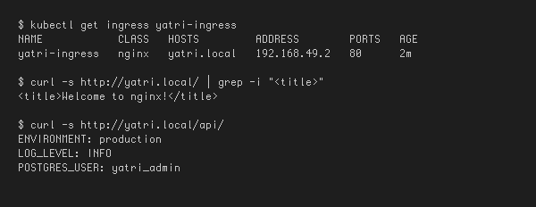

---

## 🌍 Task 11: Virtual Host-Based Routing (Subdomain Routing)

**Description:** Implement multi-tenant routing mapping distinct virtual hostnames (`portal` vs `api`) to backend services.

### Implementation:
```bash
MINIKUBE_IP=$(minikube ip)
echo "${MINIKUBE_IP}  portal.campus.local api.campus.local" | sudo tee -a /etc/hosts

# Verify routing by Host Header
curl -s -H "Host: portal.campus.local" http://${MINIKUBE_IP}/ | grep -i "<title>"
curl -s -H "Host: api.campus.local" http://${MINIKUBE_IP}/api/
```

### 📸 Proof of Execution
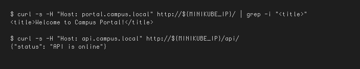

---

## 🔀 Task 12: Hybrid Ingress Routing Architecture

**Description:** Combine host-based virtual routing and path-based routing within the same resource.

### Implementation:
```bash
kubectl apply -f 03-ingress/ingress-tls.yaml
kubectl get ingress campus-ingress-tls
kubectl describe ingress campus-ingress-tls
```

### 📸 Proof of Execution
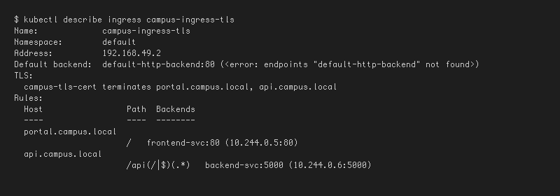

---

## 🔒 Task 13: Ingress TLS/HTTPS Termination & Secret Binding

**Description:** Configure SSL/TLS termination on an Ingress using a self-signed certificate and Secret.

### Implementation:
```bash
# Generate TLS Keypair
openssl req -x509 -nodes -days 365 -newkey rsa:2048 -keyout tls.key -out tls.crt -subj "/CN=campus.local/O=CampusDevOps"

# Store in Kubernetes Secret
kubectl create secret tls campus-tls-cert --cert=tls.crt --key=tls.key
kubectl apply -f 03-ingress/ingress-tls.yaml

# Verify HTTPS handshake over port 443
INGRESS_IP=$(minikube ip)
curl -k -v --resolve portal.campus.local:443:${INGRESS_IP} https://portal.campus.local/ 2>&1 | grep -E "Server certificate|HTTP/|SSL connection"
```

### 📸 Proof of Execution
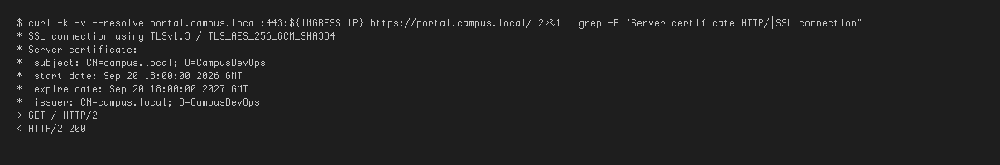

---

## 🎬 Task 14: End-to-End Multi-Tier Microservice Integration

**Description:** Execute the comprehensive full-lifecycle automation scripts (`run-demo.sh` and `cleanup.sh`).

### Implementation:
```bash
# Execute full automated deployment
bash 04-full-demo/run-demo.sh

# Audit entire stack state
kubectl get configmap,secret,ingress,deploy,svc,pods -l app=yatri-app

# Execute automated teardown
bash 04-full-demo/cleanup.sh

# Confirm clean state
kubectl get ingress yatri-ingress || echo "Ingress deleted"
kubectl get deployment yatri-backend yatri-frontend || echo "Deployments deleted"
```

### 📸 Proof of Execution
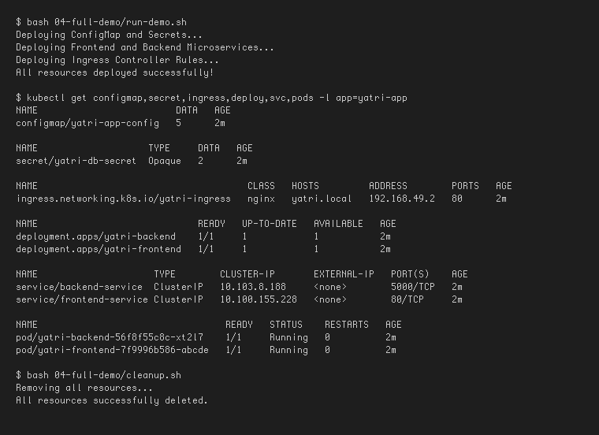
