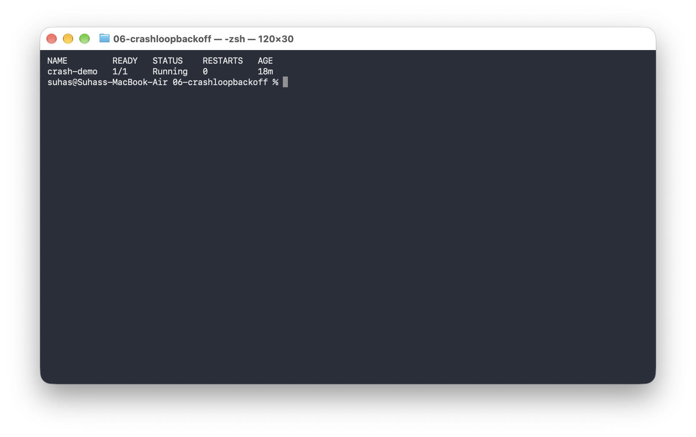
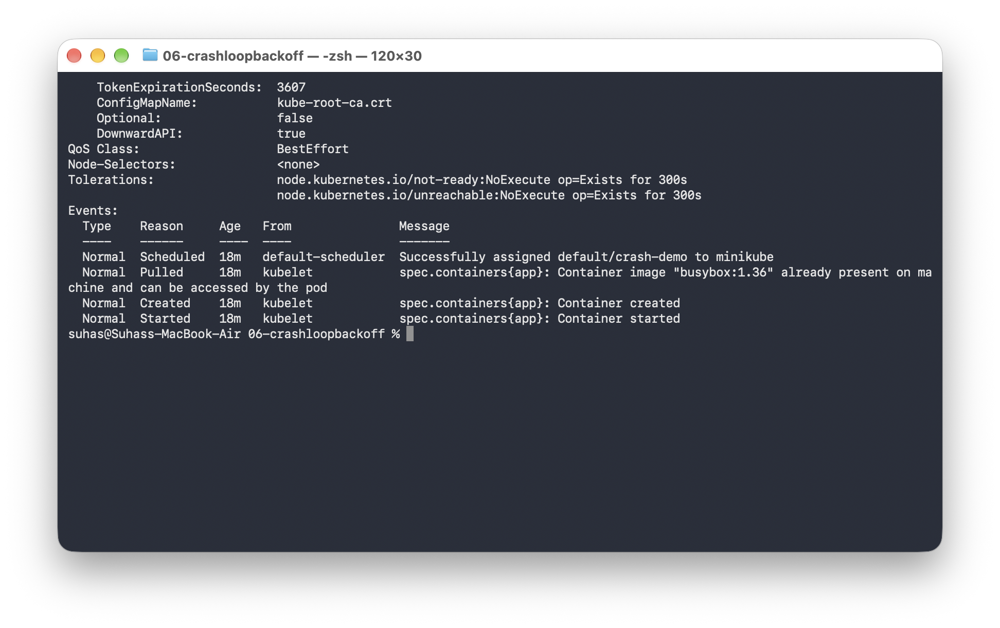
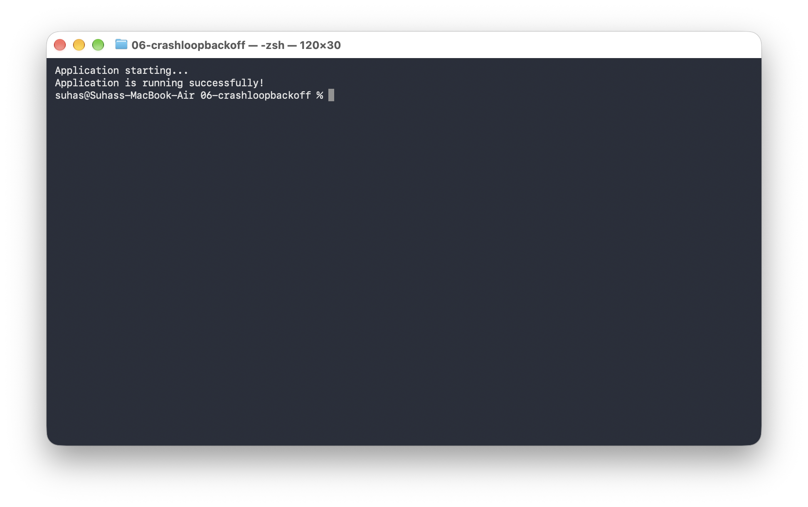
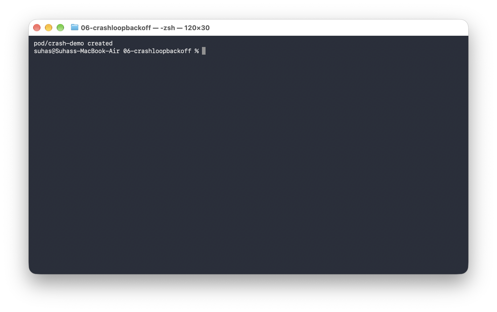
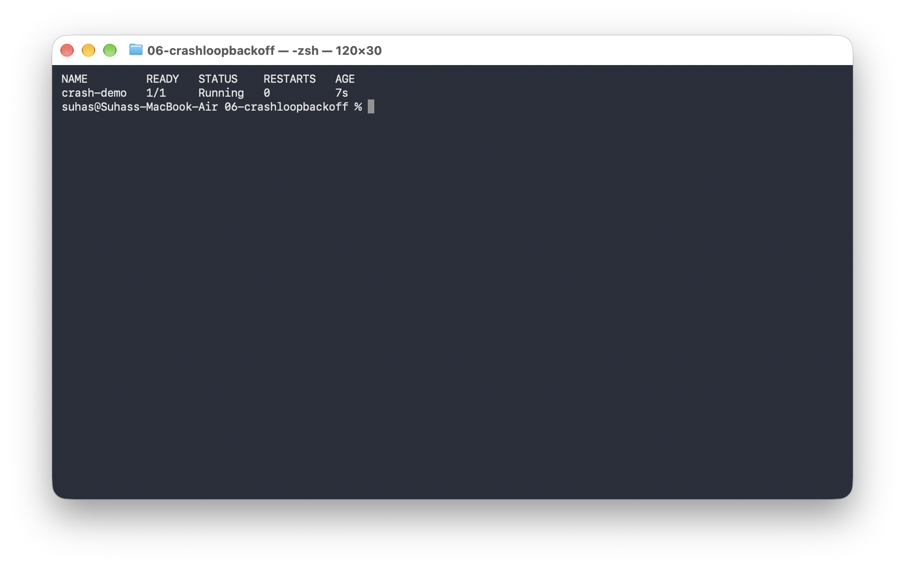
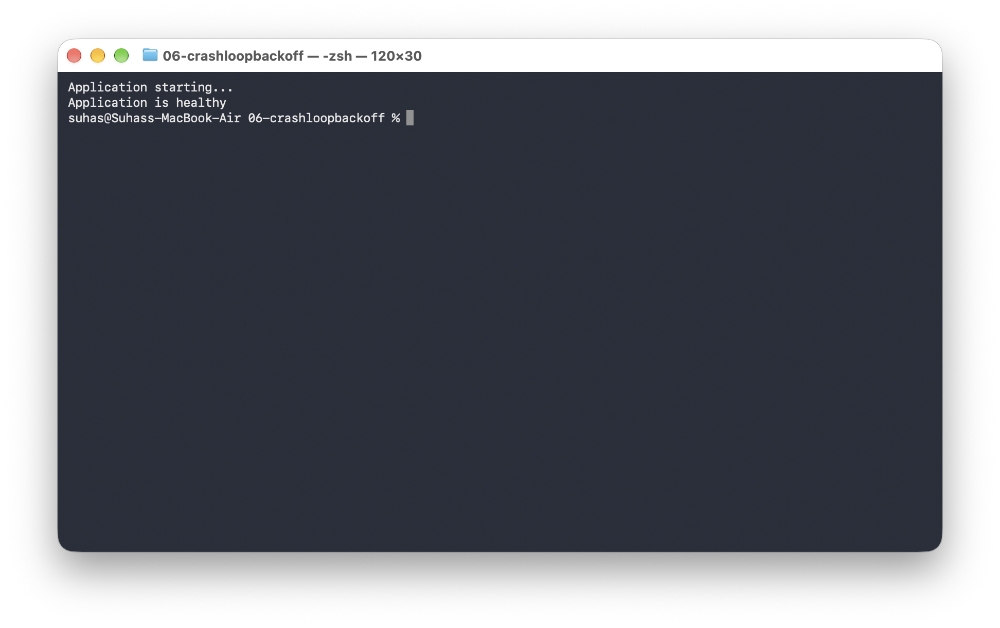

# `CrashLoopBackOff`

```text
See problem
     │
     ▼
Find reason
     │
     ▼
Fix problem
```

---

## 1. Create The Broken Pod

Run:

```bash
kubectl apply -f broken-pod.yaml
```


Check:

```bash
kubectl get pod crash-demo
```

You may see:

```text
NAME         READY   STATUS             RESTARTS
crash-demo   0/1     CrashLoopBackOff   3
```

*(The restart count may increase.)*



---

## 2. What Does `CrashLoopBackOff` Mean?

It means the container is repeatedly starting and failing.

Simple flow:

```text
Container starts
      │
      ▼
Application crashes
      │
      ▼
Container stops
      │
      ▼
Kubernetes restarts it
      │
      ▼
Application crashes again
      │
      ▼
Kubernetes waits
      │
      ▼
Tries again
```

The waiting time is part of Kubernetes' backoff behavior.

---

## 3. First Troubleshooting Command

Run:

```bash
kubectl describe pod crash-demo
```

Look at:
* **State**
* **Last State**
* **Restart Count**
* **Events**



---

## 4. Check Logs

Run:

```bash
kubectl logs crash-demo
```

Expected output:

```text
Application starting...
Something went wrong!
```

This tells us the application itself exited with an error.



---

## 5. Check Previous Logs

Because the container is restarting, also try:

```bash
kubectl logs crash-demo --previous
```

This is extremely useful when the current container has already restarted.

---

## 6. Find The Problem

Look at the YAML:

```yaml
exit 1
```

Exit code 1 means the command failed. So the application is crashing because we explicitly told it to exit with an error.

---

## 7. Fix The Pod

First delete the broken Pod:

```bash
kubectl delete pod crash-demo
```


Create the fixed version:

```bash
kubectl apply -f fixed-pod.yaml
```



Check:

```bash
kubectl get pod crash-demo
```

Expected output:

```text
NAME         READY   STATUS
crash-demo   1/1     Running
```



---

## 8. Check Logs Again

```bash
kubectl logs crash-demo
```

Expected output:

```text
Application starting...
Application is healthy
```



---

## Troubleshooting Flow

Remember this flow:

```text
kubectl get pod
       │
       ▼
    STATUS?
       │
       ▼
CrashLoopBackOff
       │
       ▼
kubectl describe pod
       │
       ▼
  kubectl logs
       │
       ▼
kubectl logs --previous
       │
       ▼
Find root cause
       │
       ▼
      Fix
```

---

## Key Learning

`CrashLoopBackOff` is a symptom, not the actual root cause.

The actual reason could be:
* Application error
* Wrong command
* Missing environment variable
* Configuration problem
* Failed dependency
* Bad probe
* Permission problem

Always investigate instead of simply restarting the Pod.

---

## Reference

* **Kubernetes Pod debugging documentation:**  
  https://kubernetes.io/docs/tasks/debug/debug-application/
* **Kubernetes Pod States:**  
  https://kubernetes.io/docs/concepts/workloads/pods/pod-lifecycle/#pod-phase

