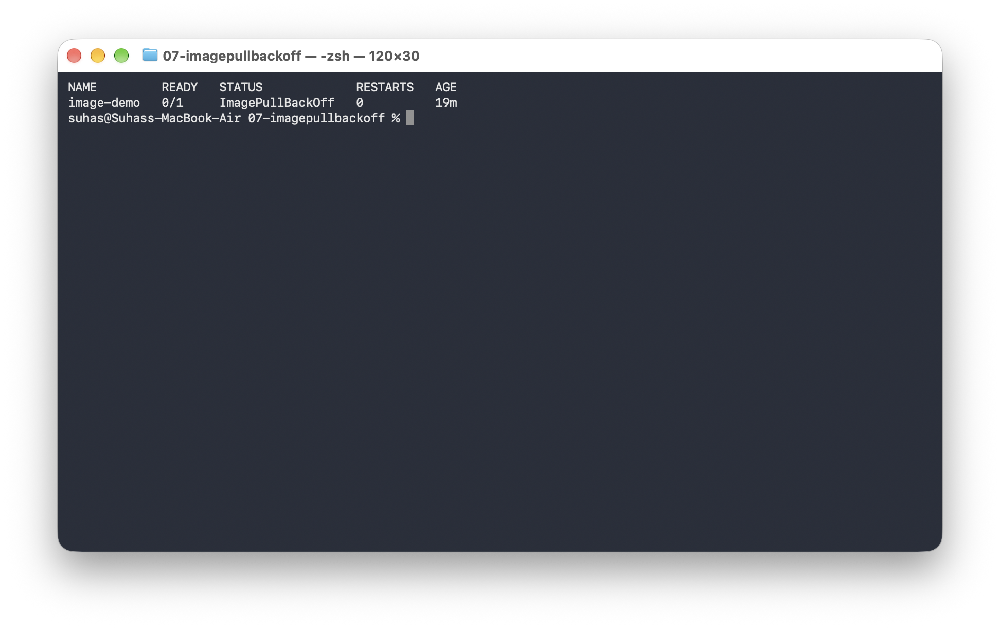
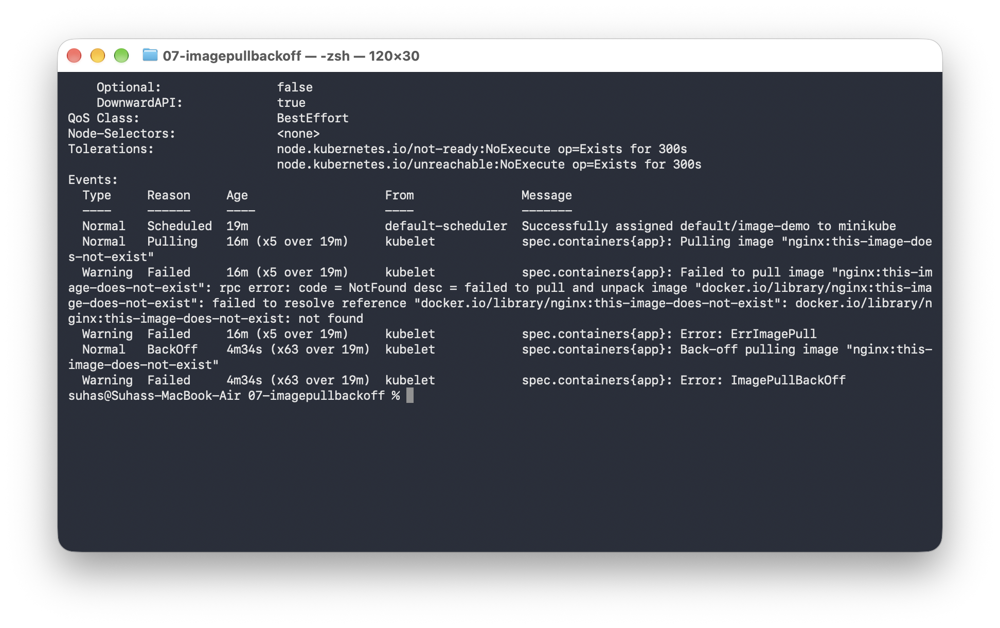
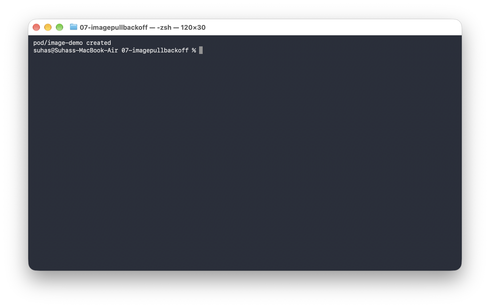
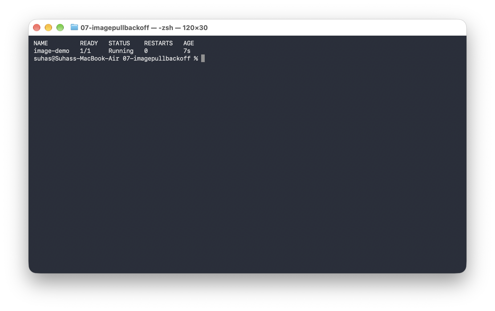

# `ImagePullBackOff`

```bash
ImagePullBackOff
```

---

## 1. Create The Broken Pod

```bash
kubectl apply -f broken-pod.yaml
```


Check:

```bash
kubectl get pod image-demo
```

You may see:

```text
NAME         READY   STATUS             RESTARTS
image-demo   0/1     ErrImagePull       0
```

After some retries, you may see:

```text
NAME         READY   STATUS             RESTARTS
image-demo   0/1     ImagePullBackOff   0
```



---

## 2. What Does It Mean?

Kubernetes tried to download the image, but it could not.

Simple flow:

```text
Pod
 │
 ▼
Need container image
 │
 ▼
Kubernetes tries to pull image
 │
 ▼
Pull fails
 │
 ▼
Kubernetes retries
 │
 ▼
ImagePullBackOff
```

---

## 3. Describe The Pod

Run:

```bash
kubectl describe pod image-demo
```

Go to the **Events** section. You should see a message similar to:

```text
Failed to pull image
```

*(The exact message depends on the container runtime and cluster.)*



---

## 4. Check The Image Name

Our YAML contains:

```yaml
image: nginx:this-image-does-not-exist
```

That image tag does not exist. This is the problem.

---

## 5. Fix The Image

Delete the broken Pod:

```bash
kubectl delete pod image-demo
```


Apply the fixed YAML:

```bash
kubectl apply -f fixed-pod.yaml
```



Check:

```bash
kubectl get pod image-demo
```

Expected output:

```text
NAME         READY   STATUS
image-demo   1/1     Running
```



---

## 6. Other Possible Causes

`ImagePullBackOff` can happen because of:
* Wrong image name
* Wrong image tag
* Private registry authentication problem
* Registry unavailable
* Network problem
* Image does not exist

---

## Troubleshooting Flow

```text
ImagePullBackOff
       │
       ▼
kubectl describe pod
       │
       ▼
Look at Events
       │
       ▼
Check image name
       │
       ▼
Check image tag
       │
       ▼
Check registry access
       │
       ▼
      Fix
```

---

## Key Learning

Remember:

```text
CrashLoopBackOff
  = Container starts but keeps failing

ImagePullBackOff
  = Kubernetes cannot get the image
```

---

## Reference

* **Pull an Image from a Private Registry:**  
  https://kubernetes.io/docs/tasks/configure-pod-container/pull-image-private-registry/

