# Kubernetes Troubleshooting Challenge

Your job is to:

```text
Deploy
  │
  ▼
Observe
  │
  ▼
Break
  │
  ▼
Investigate
  │
  ▼
Find root cause
  │
  ▼
Fix
  │
  ▼
Verify
```

---

## Project Scenario

You have a simple Nginx application running inside Kubernetes.

You have:
* Deployment
* Service
* Pods

Your application should be accessible through the Service. But your team has reported that something is wrong.

Your job is to find and fix the problems.

---

## 1. Deploy The Application

Run:

```bash
kubectl apply -f deployment.yaml
kubectl apply -f service.yaml
```

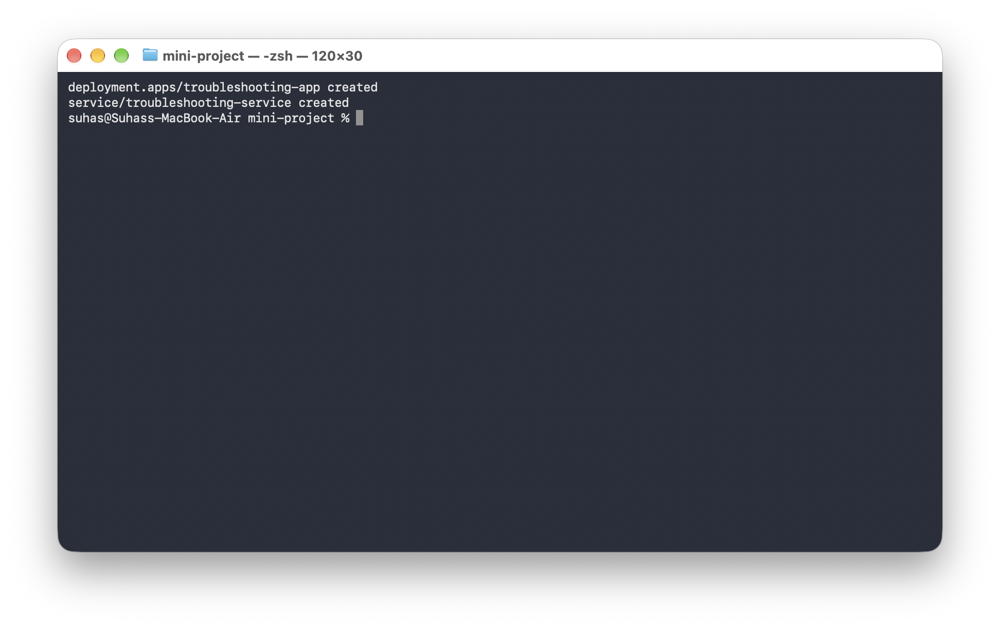

Check:

```bash
kubectl get pods
kubectl get service
```

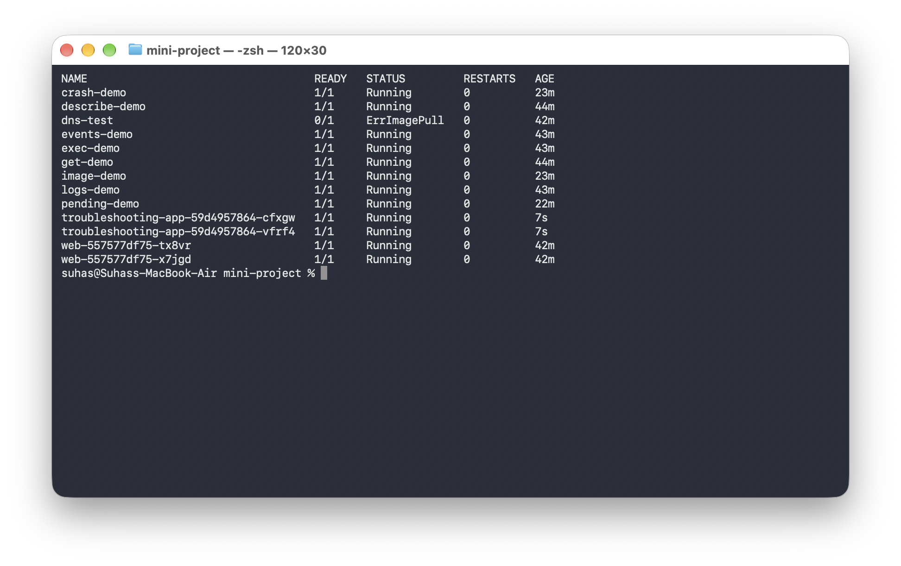


---

## 2. Check The Application

Run:

```bash
kubectl get pods -o wide
```

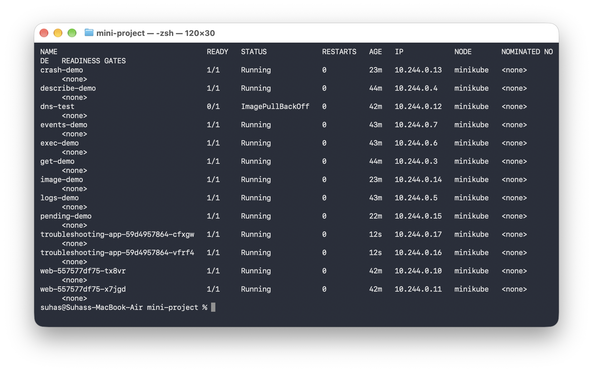

Then:

```bash
kubectl describe pod <pod-name>
```

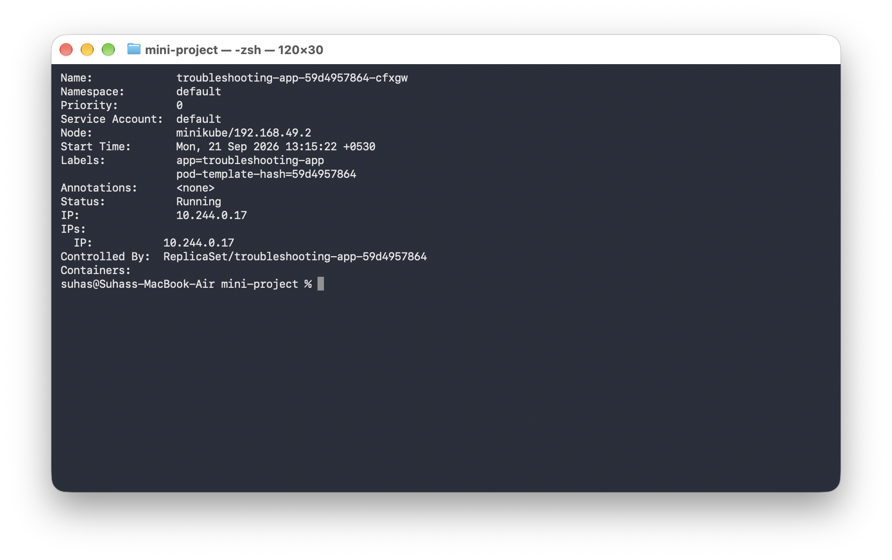

Then:

```bash
kubectl logs <pod-name>
```

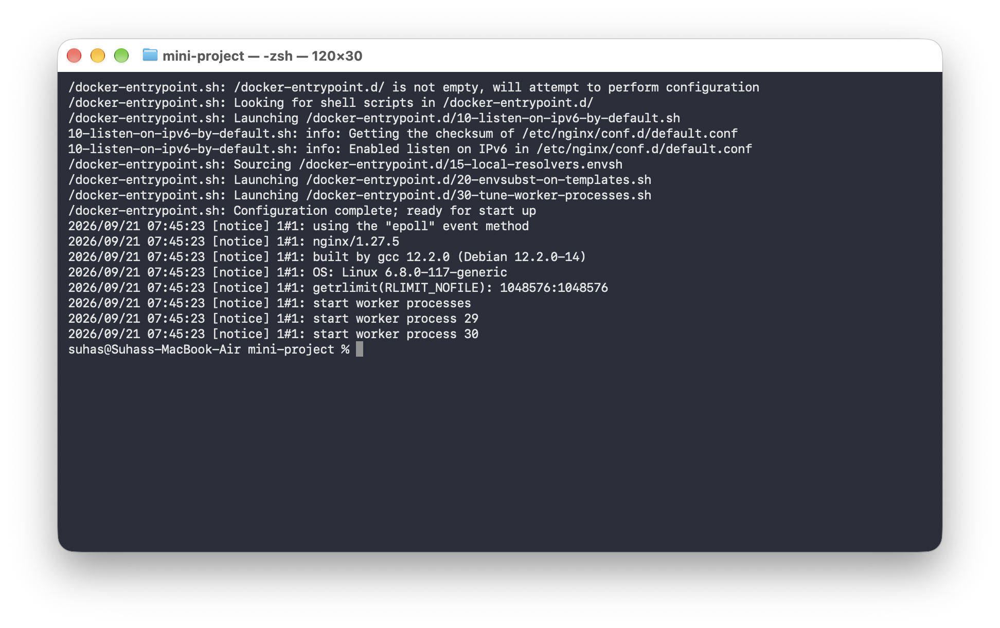

Then:

```bash
kubectl exec -it <pod-name> -- bash
```

Inside the container:

```bash
curl localhost
```

You should get the Nginx response.

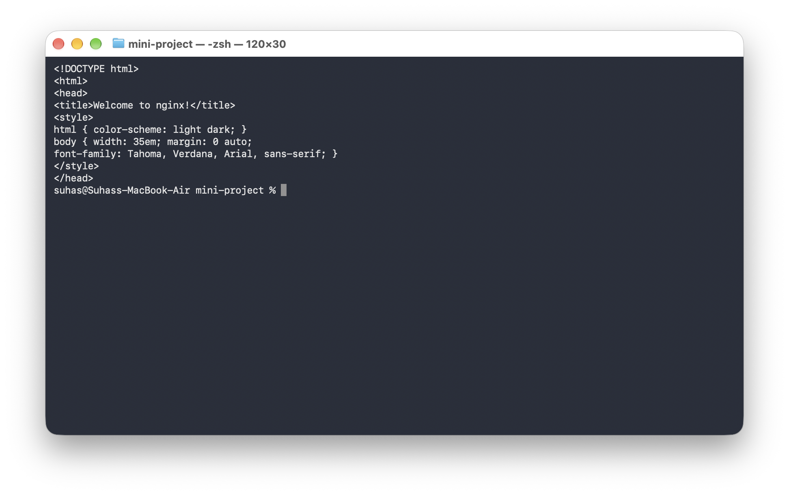

---

## 3. Check The Service

Run:

```bash
kubectl get service
```

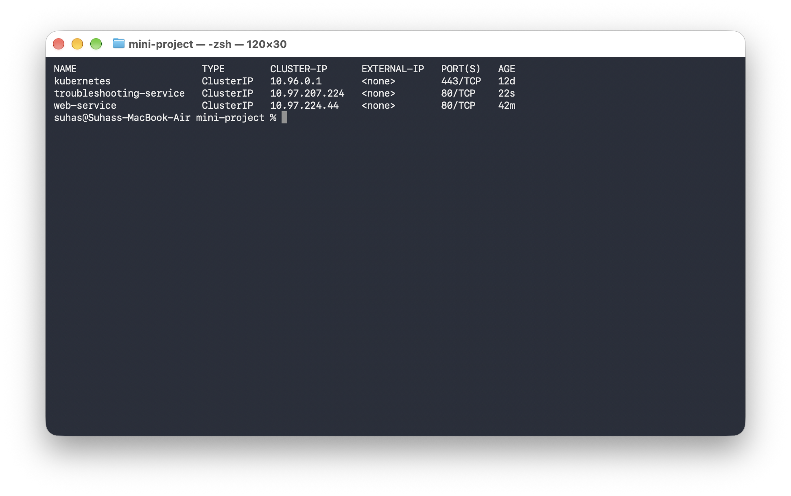

Then:

```bash
kubectl describe service troubleshooting-service
```

Check:
* **Selector**
* **TargetPort**
* **Endpoints**

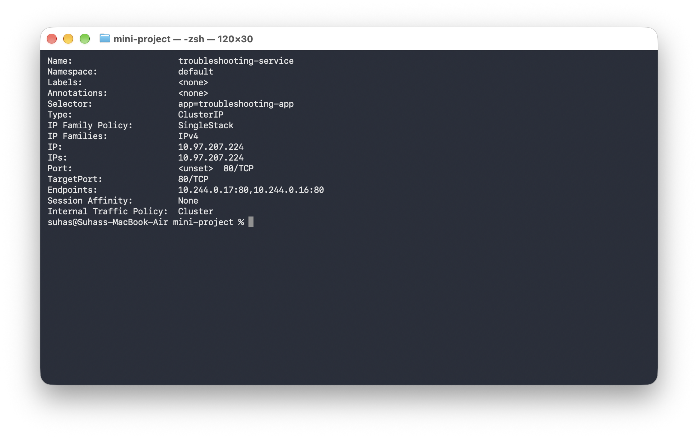

---

## 4. Check Endpoints

Run:

```bash
kubectl get endpoints troubleshooting-service
```

You should see Pod IP addresses.

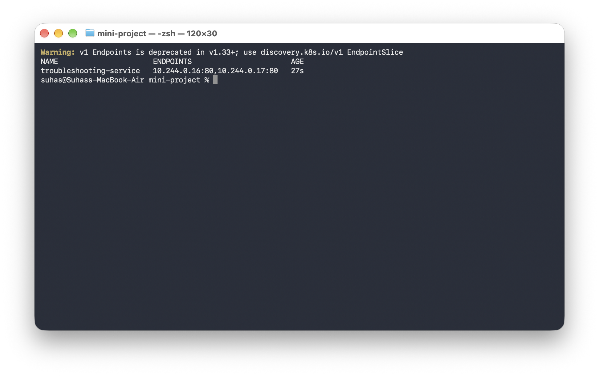

---

## 5. Create A Broken Pod

Run:

```bash
kubectl apply -f broken-pod.yaml
```

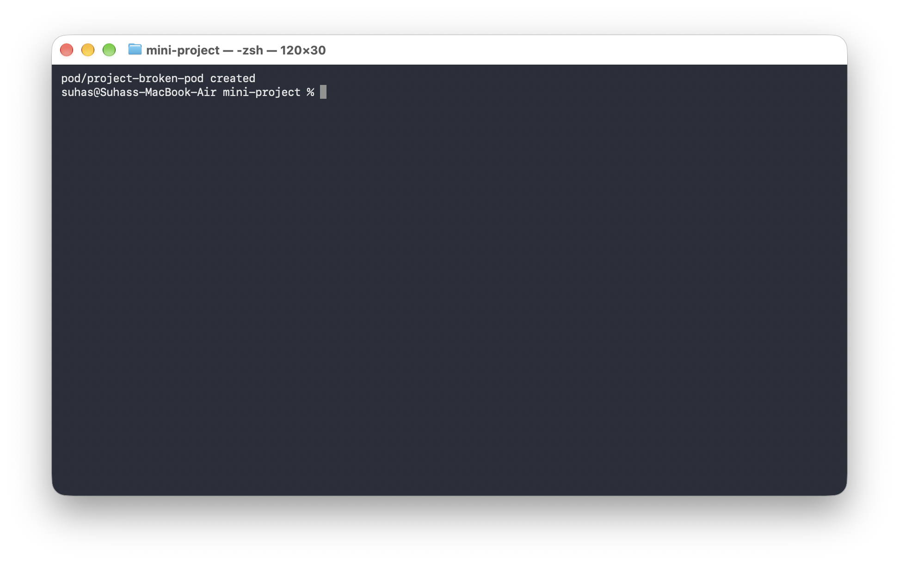

Check:

```bash
kubectl get pod project-broken-pod
```

You should see an image-related problem.


---

## 6. Troubleshoot It

You are **NOT** allowed to immediately change the YAML.

First run:

```bash
kubectl get pod project-broken-pod
```

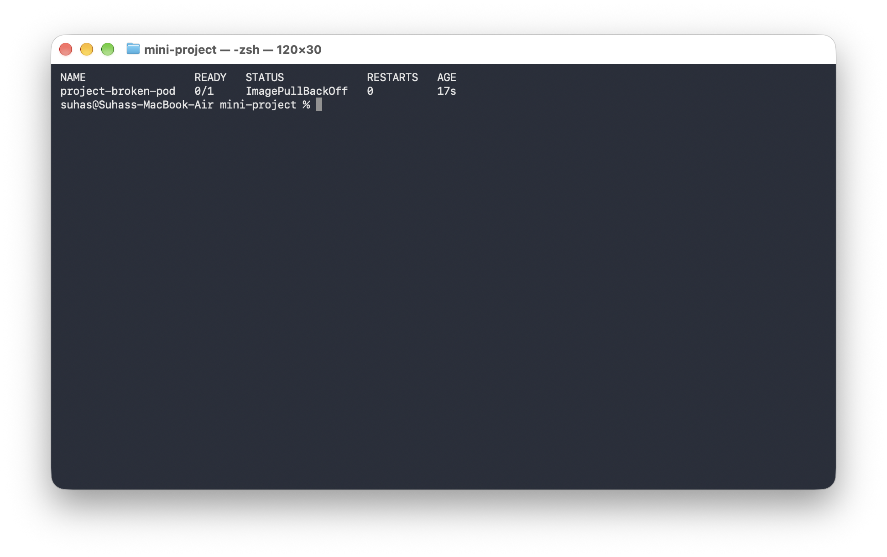

Then:

```bash
kubectl describe pod project-broken-pod
```

Then look at **Events**. Find the root cause.

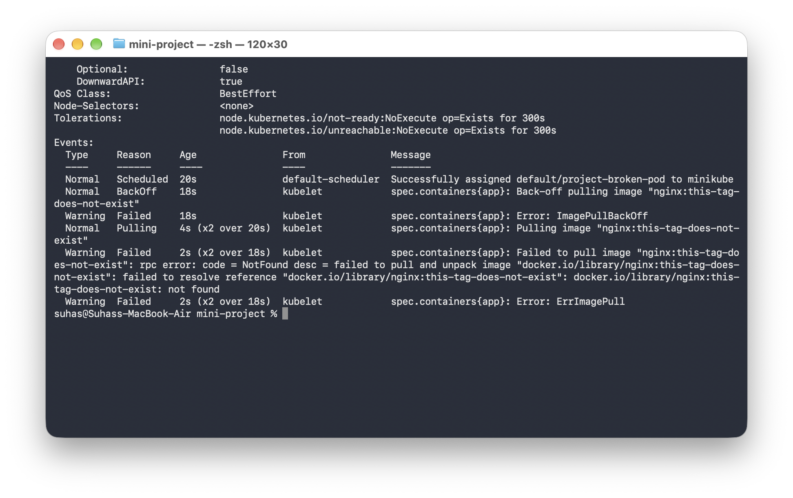

---

## 7. Your Task

For the broken Pod, answer:

**Question 1:** What is the Pod status?  
*Answer:*  

**Question 2:** What is the actual error?  
*Answer:*  

**Question 3:** Which command helped you find the reason?  
*Answer:*  

**Question 4:** What is wrong with the image?  
*Answer:*  

**Question 5:** How would you fix it?  
*Answer:*  

---

## 8. Service Troubleshooting Challenge

Now intentionally create a Service selector problem.

Change the Service selector from:

```yaml
selector:
  app: troubleshooting-app
```

to:

```yaml
selector:
  app: wrong-app
```


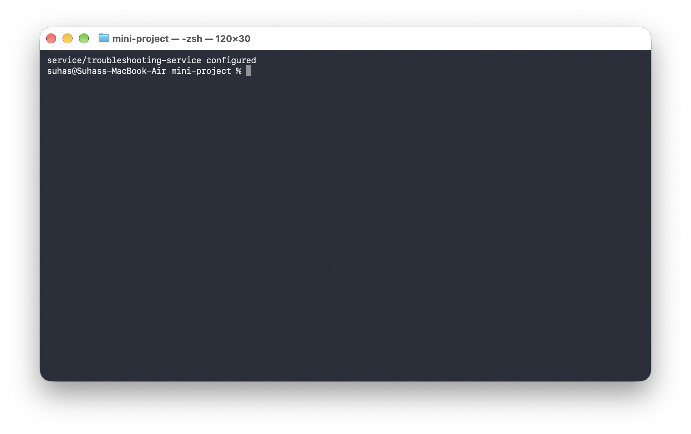
Apply it. Then run:

```bash
kubectl get service
```


Then:

```bash
kubectl get endpoints troubleshooting-service
```

You should find: `<none>`.

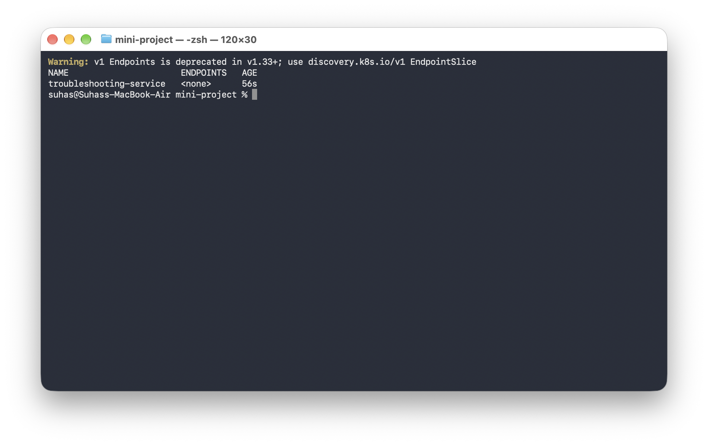

---

## 9. Find The Root Cause

Run:

```bash
kubectl get pods --show-labels
```

Check the Pod label.

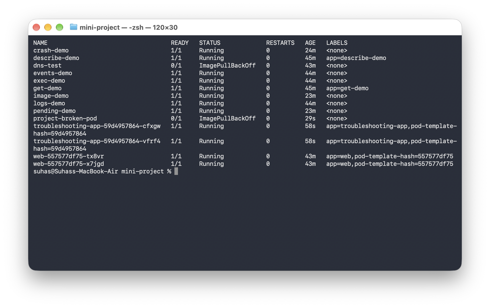

Then:

```bash
kubectl describe service troubleshooting-service
```

Compare **Pod label** with **Service selector**. Find the mismatch and fix it.

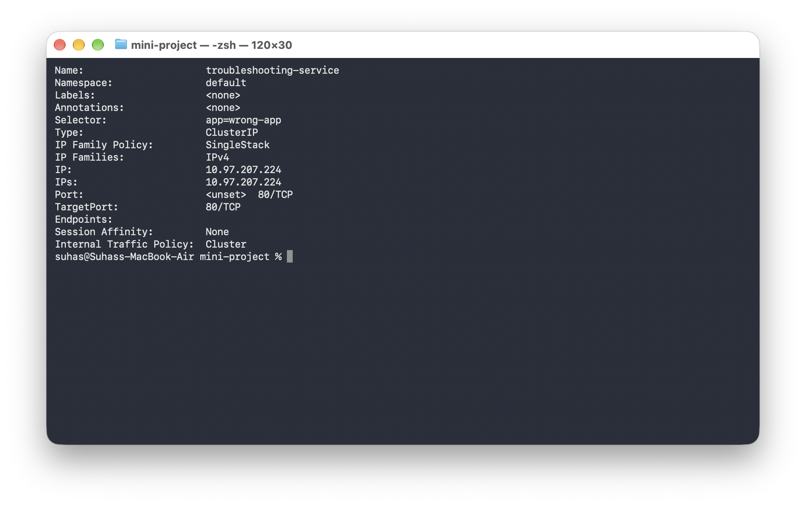

---

## 10. Final Troubleshooting Checklist

Before saying: *"It is not working."*

Always check:

```bash
kubectl get pods
kubectl describe pod <pod-name>
kubectl logs <pod-name>
kubectl exec -it <pod-name> -- sh
kubectl get events
```

For Service problems:

```bash
kubectl describe service <service-name>
kubectl get endpoints <service-name>
nslookup <service-name>
```

---

## 11. Troubleshooting Table

Fill this table in your submission:

| Problem | What I Saw | Command I Used | Root Cause | Fix |
| :--- | :--- | :--- | :--- | :--- |
| **Broken Pod** | | | | |
| **Service Problem** | | | | |
| **Image Problem** | | | | |

---

## 12. README Questions

Answer these in your own words:

1. What does `kubectl get` tell us?
2. What is the difference between `get` and `describe`?
3. Why do we use `kubectl logs`?
4. When would you use `kubectl exec`?
5. What does `CrashLoopBackOff` mean?
6. What does `ImagePullBackOff` mean?
7. Why can a Pod remain `Pending`?
8. Why can a Service have no endpoints?
9. What is the relationship between a Service selector and Pod labels?
10. What is Kubernetes DNS?

---

## 13. Final Architecture

Your final application should look like:

```text
                    Kubernetes Cluster
                            │
                            ▼
                  ┌───────────────────┐
                  │      Service      │
                  └─────────┬─────────┘
                            │
                     Service Selector
                            │
              ┌─────────────┴─────────────┐
              │                           │
              ▼                           ▼
            Pod 1                       Pod 2
              │                           │
              └─────────────┬─────────────┘
                            │
                        Nginx App
```

---

## 14. What You Should Be Able To Do

After completing this project, you should be comfortable with:

```bash
kubectl get
kubectl describe
kubectl logs
kubectl exec
kubectl events
```

and troubleshooting:
* `CrashLoopBackOff`
* `ImagePullBackOff`
* `Pending`
* Service problems
* DNS problems

---

## Final Rule

When something breaks: **DON'T GUESS.**

```text
GET
 │
 ▼
DESCRIBE
 │
 ▼
EVENTS
 │
 ▼
LOGS
 │
 ▼
EXEC
 │
 ▼
TEST
 │
 ▼
FIX
 │
 ▼
VERIFY
```

That is the basic Kubernetes troubleshooting mindset.