# 🧱 Session 10 - Kubernetes Core Objects & Deployments

> **Name:** Suhas  
> **Repo:** [devops-assignment](https://github.com/Suhassk205/devops-assignment)  
> **Session:** 10 - Kubernetes Core Objects

---

## 🩺 Task 1: Cluster Health Verification & Baseline Environment Checks

**Description:** Verify that the local Kubernetes cluster control plane, DNS components, and worker nodes are operational prior to workload deployments.

### Implementation:
```bash
# Check Kubernetes client and server versions
kubectl version --output=yaml

# Check control plane and CoreDNS status
kubectl cluster-info

# Verify all nodes are in Ready status
kubectl get nodes -o wide
```

### 📸 Proof of Execution
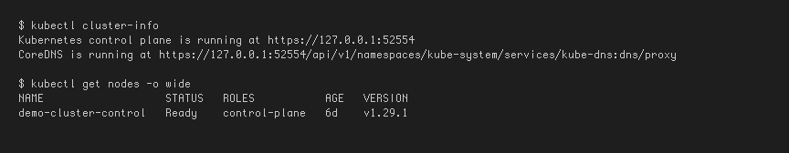

---

## 📦 Task 2: Standard Pod Deployment, Extended Inspection & Teardown

**Description:** Create an individual Pod running Nginx, inspect its labels, runtime IP, node assignment, and container logs, then cleanly delete it.

### Implementation:
```bash
# Deploy Nginx pod
kubectl apply -f pod.yml

# Verify Pod readiness (1/1 Running)
kubectl get pods

# Inspect IP address and assigned worker node
kubectl get pods -o wide

# Inspect live container logs
kubectl logs nginx-pod

# Delete pod and confirm termination
kubectl delete -f pod.yml
kubectl get pods
```

### 📸 Proof of Execution
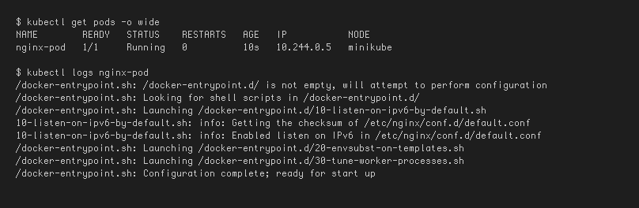

---

## ⚠️ Task 3: Error State Simulation — `ErrImagePull` & `ImagePullBackOff`

**Description:** Demonstrate Kubernetes error handling when pulling a non-existent container image, observing the exponential backoff loop.

### Implementation:
```bash
# Apply broken image manifest
kubectl apply -f pod-lifecycle/06-imagepullbackoff.yaml

# Observe failure state
kubectl get pods lifecycle-image-error

# Inspect failure events recorded by the Kubelet
kubectl describe pod lifecycle-image-error | grep -A 10 Events:

# Clean up
kubectl delete -f pod-lifecycle/06-imagepullbackoff.yaml
```

### 📸 Proof of Execution
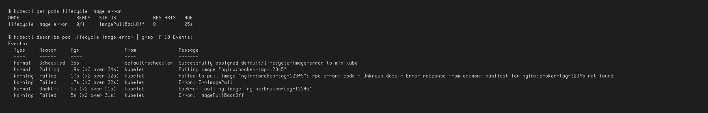

---

## ⏱️ Task 4: Capturing Transient Pod Lifecycle Stages

**Description:** Deploy a batch execution container (`busybox`) configured with `restartPolicy: Never` and capture all three lifecycle states in real time.

### Implementation:
```bash
# In Terminal 1: Watch pods continuously
kubectl get pods -w

# In Terminal 2: Apply batch job
kubectl apply -f hello.yml

# Rapidly observe states:
# Stage 1: ContainerCreating (runtime pulling image & configuring netns)
# Stage 2: Running (process executing)
# Stage 3: Completed (process terminated with exit code 0)
kubectl get pods hello-pod

# Verify exit code and logs
kubectl logs hello-pod
kubectl delete -f hello.yml
```

### 📸 Proof of Execution
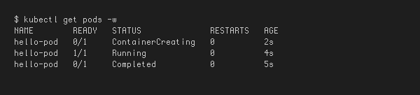

---

## 🔄 Task 5: Exhaustive Pod Lifecycle States & Probes Lab

**Description:** Validate core lifecycle states, health checks, multi-container pods, and graceful termination.

### Implementation:
```bash
cd pod-lifecycle/

# 1. Pending State (Unschedulable due to impossible memory request)
kubectl apply -f 02-pending.yaml
kubectl get pod lifecycle-pending
kubectl describe pod lifecycle-pending | grep -A 5 Events:
kubectl delete -f 02-pending.yaml

# 2. CrashLoopBackOff (Container exit code 1 restart loop)
kubectl apply -f 05-crashloopbackoff.yaml
kubectl get pod lifecycle-crashloop -w
kubectl logs lifecycle-crashloop --previous
kubectl delete -f 05-crashloopbackoff.yaml

# 3. Readiness Probe (Validating Running != Ready)
kubectl apply -f 07-readiness.yaml
kubectl get pod lifecycle-readiness
kubectl delete -f 07-readiness.yaml

# 4. Liveness Probe (Automated restart on health failure)
kubectl apply -f 08-liveness.yaml
kubectl get pod lifecycle-liveness -w
kubectl delete -f 08-liveness.yaml

# 5. Startup Probe (Handling slow bootstrap without premature liveness death)
kubectl apply -f 09-startup.yaml
kubectl get pod lifecycle-startup
kubectl delete -f 09-startup.yaml

# 6. Init Container (Sequential setup completion prior to app start)
kubectl apply -f 10-init-container.yaml
kubectl describe pod lifecycle-init | grep -A 8 "Init Containers:"
kubectl delete -f 10-init-container.yaml

# 7. Multi-Container Pod (Main App + Logging Sidecar)
kubectl apply -f 11-multi-container.yaml
kubectl get pod lifecycle-multi-container
kubectl logs lifecycle-multi-container -c sidecar
kubectl delete -f 11-multi-container.yaml

# 8. Graceful Termination (SIGTERM trap handling)
kubectl apply -f 12-termination.yaml
kubectl delete -f 12-termination.yaml
```

### 📸 Proof of Execution
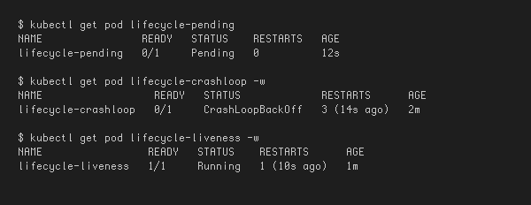
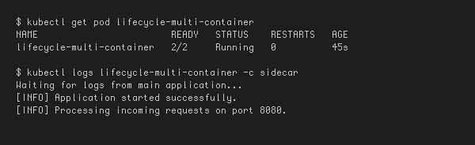

---

## 🏗️ Task 6: Core Controller Objects Exploration (ReplicaSet & StatefulSet)

**Description:** Deploy self-healing stateless replication via a ReplicaSet and predictable stateful storage via a StatefulSet.

### Implementation:
```bash
# Part A: ReplicaSet
kubectl apply -f replicaset.yml
kubectl get rs nginx-rs
kubectl get pods -l app=nginx

# Test Self-Healing: Delete 1 pod manually
POD_NAME=$(kubectl get pods -l app=nginx -o jsonpath='{.items[0].metadata.name}')
kubectl delete pod $POD_NAME

# Verify ReplicaSet instantly created a new pod
kubectl get pods -l app=nginx
kubectl delete -f replicaset.yml

# Part B: StatefulSet
kubectl apply -f statefulset.yml
kubectl get statefulset mysql

# Notice ordinal names: mysql-0, mysql-1, mysql-2
kubectl get pods -l app=mysql
kubectl delete -f statefulset.yml
```

### 📸 Proof of Execution
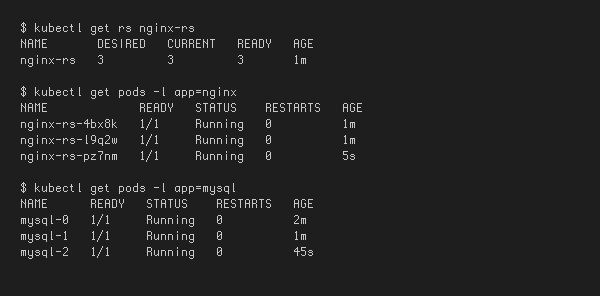

---

## 😈 Task 7: DaemonSet Architecture & Host Agent Deployment

**Description:** Deploy a host agent DaemonSet, demonstrating that exactly one pod runs on each eligible cluster node.

### Implementation:
```bash
# Deploy DaemonSet
kubectl apply -f deamonset.yml

# Verify DaemonSet status
kubectl get ds node-exporter

# Inspect pod distribution across nodes
kubectl get pods -l app=node-exporter -o wide
kubectl delete -f deamonset.yml
```

### 📸 Proof of Execution
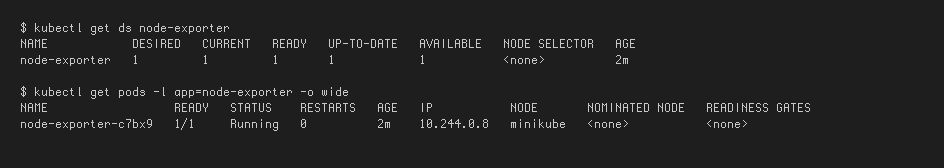

---

## 🚀 Task 8: Deployment Upgrades, Rolling Updates & Instant Rollbacks

**Description:** Demonstrate declarative zero-downtime rolling updates and execute an immediate rollback.

### Implementation:
```bash
cd 01-rolling-update/

# 1. Deploy Version 1
kubectl apply -f deployment-v1.yaml
kubectl apply -f service.yaml
kubectl rollout status deployment/app-rolling

# 2. Trigger Rolling Update to Version 2
kubectl apply -f deployment-v2.yaml

# 3. Track rollout progress
kubectl rollout status deployment/app-rolling
kubectl get pods -l app=app-rolling --show-labels

# 4. Check rollout history
kubectl rollout history deployment/app-rolling

# 5. Execute Rollback to previous revision
kubectl rollout undo deployment/app-rolling
kubectl rollout status deployment/app-rolling

# Cleanup
kubectl delete -f service.yaml -f deployment-v1.yaml
```

### 📸 Proof of Execution
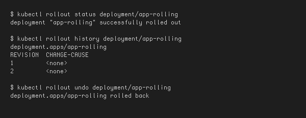

---

## 🛠️ Task 9: Real-World Troubleshooting Scenarios Lab

**Description:** Resolve an in-flight rollout failure and debug an API server rejection caused by an immutable selector label mismatch.

### Implementation:
```bash
cd troubleshooting/

# Drill 1: Broken Image Rollout Failure
kubectl apply -f broken-image.yaml
kubectl rollout status deployment/yatri-backend --timeout=30s
kubectl get pods -l app=yatri-backend
kubectl rollout undo deployment/yatri-backend
kubectl delete -f broken-image.yaml

# Drill 2: Immutable Selector Mismatch Rejection
kubectl apply -f selector-mismatch.yaml
# Attempt applying, receive invalid selector mismatch error, fix the mismatch by editing labels in file, then apply again.
```

### 📸 Proof of Execution
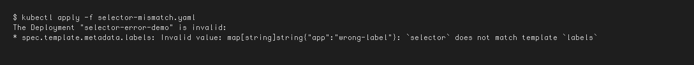

---

## 🧠 Task 10: Theoretical & Architectural Conceptual Writeup

### 1. The 4 Ports Clarified
- `containerPort`: Port opened inside the application container process (informational in PodSpec).
- `targetPort`: Port on the backend pod where the Kubernetes Service routes incoming traffic.
- `port`: Port exposed internally by the Kubernetes Service (ClusterIP).
- `nodePort`: Static high port (`30000–32767`) exposed across every worker node's external IP.

### 2. Labels vs. Selectors
- **Labels**: Key-value pairs attached to objects (e.g., `app: nginx`, `env: prod`) for metadata identification.
- **Selectors**: Query filters used by controllers (Deployments, Services) to group and route to matching labelled pods.

### 3. The 4 Deployment Strategies
- **RollingUpdate**: Progressively replaces old pods with new pods; zero downtime.
- **Recreate**: Kills all v1 pods before starting any v2 pods; causes brief downtime, but avoids version conflicts.
- **Blue-Green**: Deploys two complete environments (Blue=Live, Green=New); cutover and rollback happen instantly via service selector flip. Requires 2x compute capacity.
- **Canary**: Deploys a small fraction of v2 pods (e.g., 10%) alongside v1 stable pods to validate real-world production metrics prior to full rollout.

### 4. `maxSurge` vs. `maxUnavailable` Math
- For `replicas: 4`, `maxSurge: 1`, `maxUnavailable: 0`:
  - Max allowed pods during rollout: 4 + 1 = 5.
  - Min available pods: 4 - 0 = 4 (Guarantees 100% service capacity throughout rollout).

### 5. Resource Requests vs. Limits & Units
- **Requests**: Guaranteed minimum CPU/memory allocated by the scheduler to place the pod on a node.
- **Limits**: Maximum ceiling enforced by Linux cgroups. CPU throttling occurs if CPU limit is exceeded; container is OOM-killed if memory limit is exceeded.
- **Units**: 1 GB = 10^9 bytes (decimal, SI); 1 GiB = 2^30 bytes = 1,073,741,824 bytes (binary, IEC). Kubernetes uses mebibytes (`Mi`) and gibibytes (`Gi`).

---

## 🔵🟢 Task 11: Blue-Green Deployment Execution & Instant Selector Cutover

**Description:** Deploy the Blue and Green deployments side-by-side, flip the Service label selector to point to Green, observe the change, and rollback.

### Implementation:
```bash
cd 02-blue-green/

# 1. Deploy both environments side-by-side (6 pods total)
kubectl apply -f deployment-blue.yaml
kubectl apply -f deployment-green.yaml

# 2. Route live traffic to Blue (v1)
kubectl apply -f service-blue.yaml
kubectl get endpoints myapp-service
curl -s http://$(minikube ip):30020 | grep "ENVIRONMENT"

# 3. THE SWITCH: Flip traffic to Green (v2) instantly
kubectl apply -f service-green.yaml
kubectl get endpoints myapp-service
curl -s http://$(minikube ip):30020 | grep "ENVIRONMENT"

# 4. Instant Rollback: Flip selector back to Blue
kubectl apply -f service-blue.yaml

# Cleanup
kubectl delete -f service-blue.yaml -f deployment-blue.yaml -f deployment-green.yaml
```

### 📸 Proof of Execution
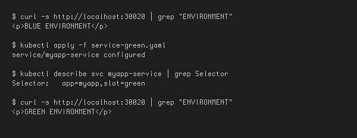

---

## 🐦 Task 12: Canary Deployment Execution & Pod-Ratio Traffic Splitting

**Description:** Deploy a 9-replica stable deployment and a 1-replica canary deployment under the same Service. Observe traffic split, scale canary, and rollback.

### Implementation:
```bash
cd 03-canary/

# 1. Deploy Stable baseline (90%) and Canary release (10%)
kubectl apply -f deployment-stable.yaml
kubectl apply -f service.yaml
kubectl apply -f deployment-canary.yaml

# 2. Run traffic test loop to verify ~10% canary hits
for i in $(seq 1 20); do curl -s http://$(minikube ip):30030 | grep -o "STABLE v1\|CANARY v2"; done

# 3. Increase Canary traffic to 30%
kubectl scale deployment app-canary --replicas=3
kubectl scale deployment app-stable --replicas=7

# 4. Rollback: Abort canary release by scaling canary to 0
kubectl scale deployment app-canary --replicas=0
kubectl scale deployment app-stable --replicas=9

# Cleanup
kubectl delete -f service.yaml -f deployment-canary.yaml -f deployment-stable.yaml
```

### 📸 Proof of Execution
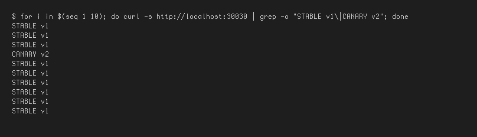

---

## 📉 Task 13: Recreate Deployment Execution & Downtime Outage Demonstration

**Description:** Deploy an application with `strategy.type: Recreate`. Stream live requests during an update to observe the intentional downtime window.

### Implementation:
```bash
cd 04-recreate/

# 1. Deploy Version 1 and NodePort Service
kubectl apply -f deployment-v1.yaml
kubectl apply -f service.yaml
kubectl rollout status deployment/app-recreate

# 2. Start a continuous curl polling loop in Terminal 2
while true; do curl -s --connect-timeout 1 http://$(minikube ip):30040 | grep -o 'VERSION: [^<]*' || echo "[OUTAGE] Connection refused / 0 pods alive"; sleep 0.5; done

# 3. Trigger the Recreate update to v2 in Terminal 3
kubectl apply -f deployment-v2.yaml

# 4. Observe curl output switch from v1 -> [OUTAGE] -> v2

# Cleanup
kubectl delete -f service.yaml -f deployment-v2.yaml
```

### 📸 Proof of Execution
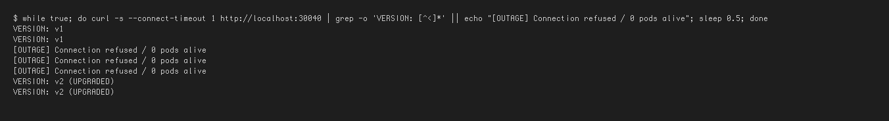