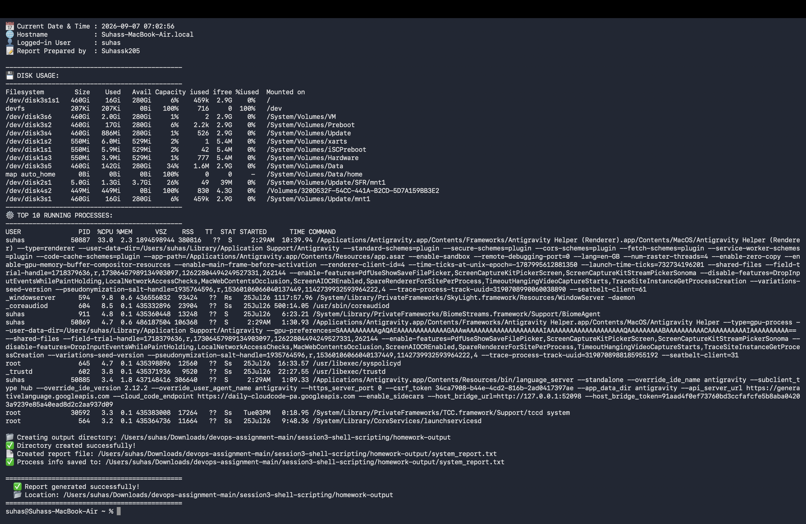

# 🐚 Session 3 - Shell Scripting Homework

> **Author:** Suhas  
> **Repo:** [devops-assignment](https://github.com/Suhassk205/devops-assignment)  
> **Session:** 3 - Shell Scripting  
> **Task:** System Information Script

---

## 📋 Table of Contents

1. [Task Overview](#task-overview)
2. [Files Structure](#files-structure)
3. [Script Explanation](#script-explanation)
4. [Commands Used](#commands-used)
5. [How to Run](#how-to-run)
6. [Sample Output](#sample-output)
7. [Proof of Execution](#proof-of-execution)

---

## Task Overview

Create a shell script that:
- ✅ Prints the current date
- ✅ Prints the hostname
- ✅ Prints the username
- ✅ Prints the disk usage
- ✅ Prints the running processes
- ✅ Uses variables to store and use data
- ✅ Takes user input using `read -p`
- ✅ Creates a directory using `mkdir`
- ✅ Creates a file using `touch`
- ✅ Stores running processes in the file using `>` output redirection

---

## Files Structure

```
session3-shell-scripting/
├── system_info.sh                   ← Main shell script (homework)
├── shell-scripting-homework.md      ← This README
├── homework-output/                 ← Auto-created by the script
│   ├── system_report.txt            ← Auto-generated report file
│   └── script_run_proof.png         ← Screenshot proof of execution
├── hello.sh
├── loop.sh
├── condition.sh
├── function.sh
├── variable.sh
├── input.sh
├── while_loop.sh
└── task.md
```

---

## Script Explanation

### `system_info.sh` - Full Breakdown

```bash
#!/bin/bash
```
> Shebang line — tells the OS to use bash to execute this script.

---

### 1️⃣ User Input with `read -p`

```bash
read -p "👤 Enter your name for this report: " USER_NAME
read -p "📁 Enter a name for the output directory: " DIR_NAME
```
> `read -p` displays a prompt and waits for the user to type input.  
> The value is stored in the variable (`USER_NAME`, `DIR_NAME`).

---

### 2️⃣ Variables

```bash
CURRENT_DATE=$(date "+%Y-%m-%d %H:%M:%S")
HOST_NAME=$(hostname)
LOGGED_USER=$(whoami)
DISK_USAGE=$(df -h)
RUNNING_PROCESSES=$(ps aux)
REPORT_DIR=".../$DIR_NAME"
REPORT_FILE="$REPORT_DIR/system_report.txt"
```
> Variables store command output using `$()` (command substitution).  
> Variables are referenced using `$VARIABLE_NAME`.

---

### 3️⃣ Print Current Date

```bash
echo "📅 Current Date & Time : $CURRENT_DATE"
```

**Command:** `date "+%Y-%m-%d %H:%M:%S"`  
**Output:**
```
📅 Current Date & Time : 2026-09-07 07:00:23
```

---

### 4️⃣ Print Hostname

```bash
echo "🌐 Hostname : $HOST_NAME"
```

**Command:** `hostname`  
**Output:**
```
🌐 Hostname : Suhass-MacBook-Air.local
```

---

### 5️⃣ Print Username

```bash
echo "👤 Logged-in User : $LOGGED_USER"
```

**Command:** `whoami`  
**Output:**
```
👤 Logged-in User : suhas
```

---

### 6️⃣ Print Disk Usage

```bash
echo "$DISK_USAGE"
```

**Command:** `df -h`  
**Output:**
```
Filesystem        Size    Used   Avail Capacity  Mounted on
/dev/disk3s1s1   460Gi    16Gi   280Gi     6%   /
/dev/disk3s5     460Gi   142Gi   280Gi    34%   /System/Volumes/Data
...
```

---

### 7️⃣ Print Running Processes

```bash
ps aux | head -11
```

**Command:** `ps aux`  
**Output (top 10):**
```
USER    PID  %CPU %MEM   COMMAND
suhas  50887 25.7  2.5   Antigravity Helper (Renderer)
suhas  50885  5.3  1.1   language_server
...
```

---

### 8️⃣ Create Directory with `mkdir`

```bash
mkdir -p "$REPORT_DIR"
```

> `-p` flag: creates all parent directories if they don't exist, no error if already exists.  
**Created:** `session3-shell-scripting/homework-output/`

---

### 9️⃣ Create File with `touch`

```bash
touch "$REPORT_FILE"
```

> `touch` creates an empty file or updates the timestamp of an existing file.  
**Created:** `homework-output/system_report.txt`

---

### 🔟 Output Redirection with `>`

```bash
{
  echo "SYSTEM REPORT"
  echo "$DISK_USAGE"
  echo "$RUNNING_PROCESSES"
} > "$REPORT_FILE"
```

> `>` redirects the output of a command into a file (overwrites).  
> `>>` would append instead of overwrite.  
**Result:** All system info is saved to `system_report.txt`.

---

## Commands Used

| Command | Purpose | Example |
|---|---|---|
| `echo` | Print text to terminal | `echo "Hello DevOps"` |
| `date` | Get current date & time | `date "+%Y-%m-%d %H:%M:%S"` |
| `hostname` | Print system hostname | `hostname` |
| `whoami` | Print current logged-in user | `whoami` |
| `df -h` | Show disk usage (human-readable) | `df -h` |
| `ps aux` | Show all running processes | `ps aux` |
| `read -p` | Prompt user for input | `read -p "Enter name: " NAME` |
| `mkdir -p` | Create directory (with parents) | `mkdir -p output/logs` |
| `touch` | Create an empty file | `touch report.txt` |
| `>` | Redirect output to file (overwrite) | `echo "hi" > file.txt` |
| `>>` | Redirect output to file (append) | `echo "hi" >> file.txt` |
| `|` | Pipe output to next command | `ps aux \| head -10` |
| `$()` | Command substitution into variable | `DATE=$(date)` |

---

## How to Run

### Step 1: Clone the repo
```bash
git clone https://github.com/Suhassk205/devops-assignment.git
cd devops-assignment/session3-shell-scripting
```

### Step 2: Give execute permission
```bash
chmod +x system_info.sh
```

### Step 3: Run the script
```bash
./system_info.sh
```

### Step 4: Follow the prompts
```
👤 Enter your name for this report: Suhas
📁 Enter a name for the output directory: homework-output
```

### Step 5: Check the generated report
```bash
cat homework-output/system_report.txt
```

---

## Sample Output

```
==============================================
       🖥️  SYSTEM INFORMATION REPORT
==============================================

👤 Enter your name for this report: Suhas
📁 Enter a name for the output directory: homework-output

----------------------------------------------
  Generating report for: Suhas
----------------------------------------------

📅 Current Date & Time : 2026-09-07 07:00:23
🌐 Hostname            : Suhass-MacBook-Air.local
👤 Logged-in User      : suhas
📝 Report Prepared by  : Suhas

----------------------------------------------
💾 DISK USAGE:
----------------------------------------------
Filesystem        Size    Used   Avail Capacity iused ifree %iused  Mounted on
/dev/disk3s1s1   460Gi    16Gi   280Gi     6%    459k  2.9G    0%   /
/dev/disk3s5     460Gi   142Gi   280Gi    34%    1.6M  2.9G    0%   /System/Volumes/Data
...

----------------------------------------------
⚙️  TOP 10 RUNNING PROCESSES:
----------------------------------------------
USER    PID   %CPU %MEM  COMMAND
suhas  50887  25.7  2.5  Antigravity Helper (Renderer)
suhas  50885   5.3  1.1  language_server
...

📁 Creating output directory: .../homework-output
✅ Directory created successfully!
📄 Created report file: .../homework-output/system_report.txt
✅ Process info saved to: .../homework-output/system_report.txt

==============================================
  ✅ Report generated successfully!
  📂 Location: .../homework-output
==============================================
```

---

## Proof of Execution

> Screenshot taken on **Suhass-MacBook-Air** — Mon 7 Sep 2026, 07:00 AM



---

## 📚 Key Concepts Learned

| Concept | Description |
|---|---|
| **Variables** | Store values: `NAME="Suhas"`, use with `$NAME` |
| **Command substitution** | Capture output: `DATE=$(date)` |
| **User input** | `read -p "prompt: " VAR` |
| **Conditionals** | `if [ condition ]; then ... fi` |
| **Output redirection** | `>` overwrites, `>>` appends |
| **Pipes** | Pass output of one command to another: `cmd1 \| cmd2` |
| **mkdir** | Create directories, `-p` for nested |
| **touch** | Create empty files |
| **chmod +x** | Make a script executable |
| **Shebang** | `#!/bin/bash` — declares the interpreter |

