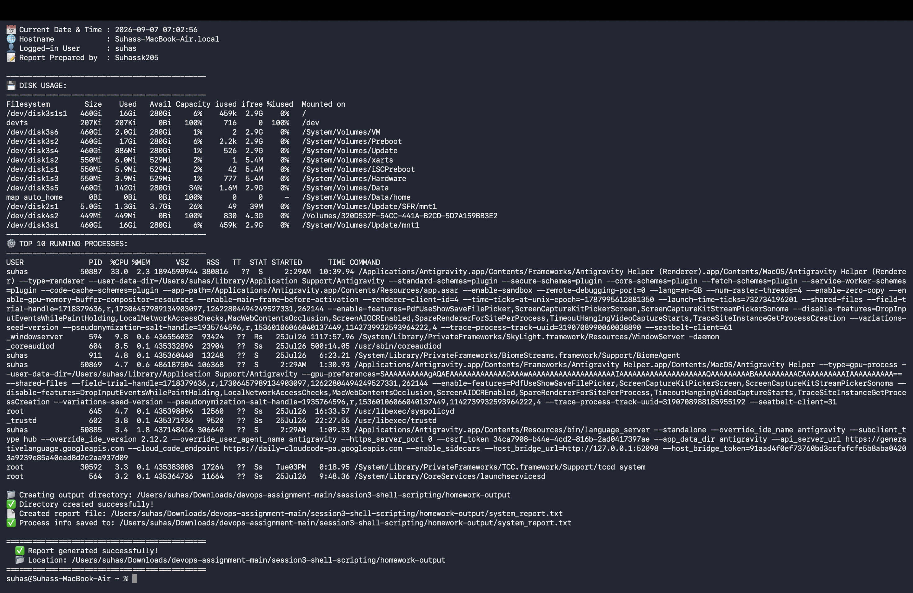
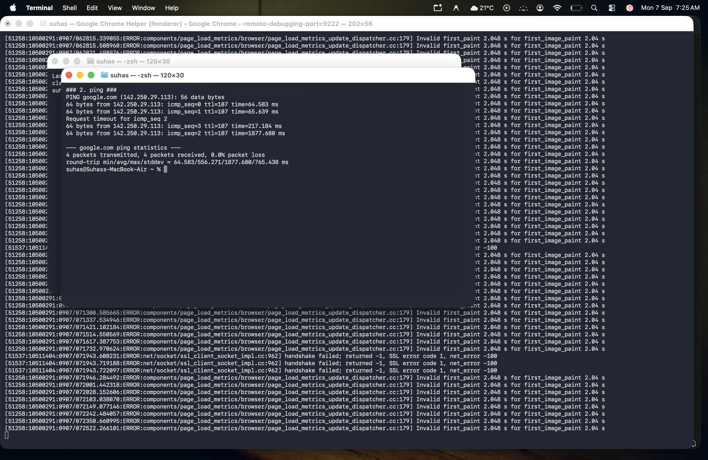
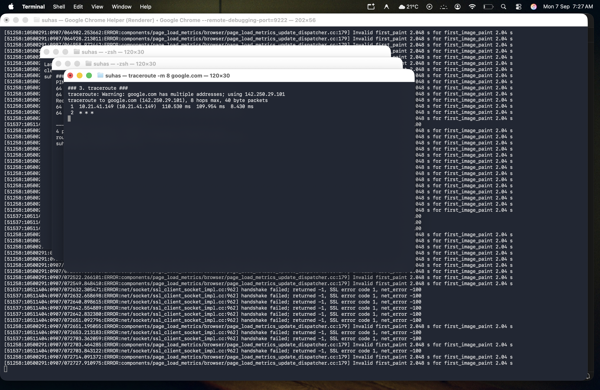
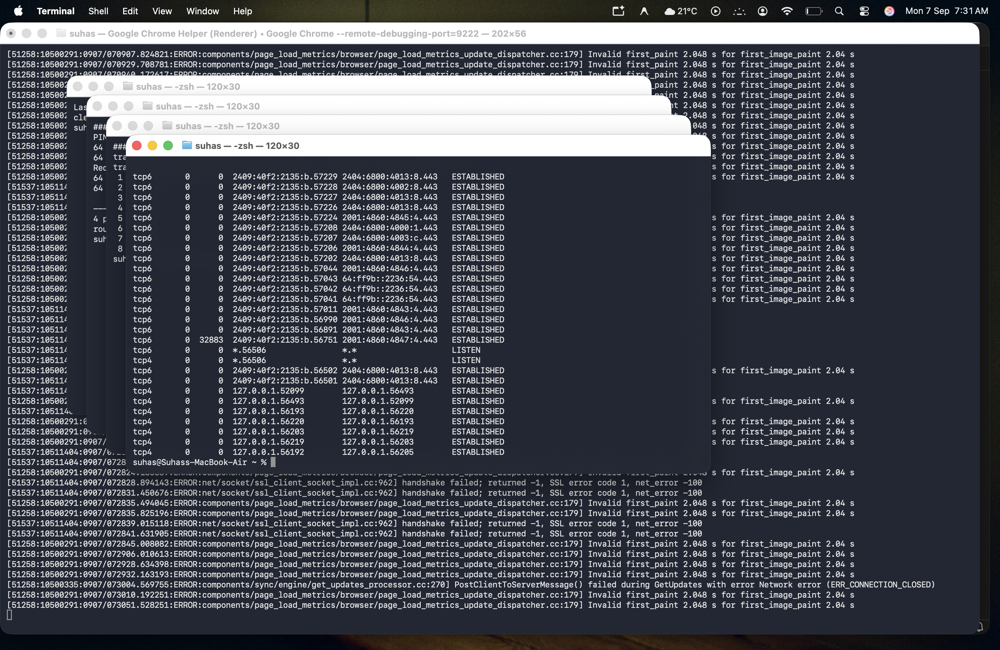
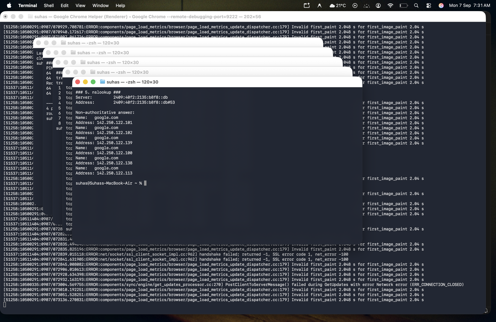
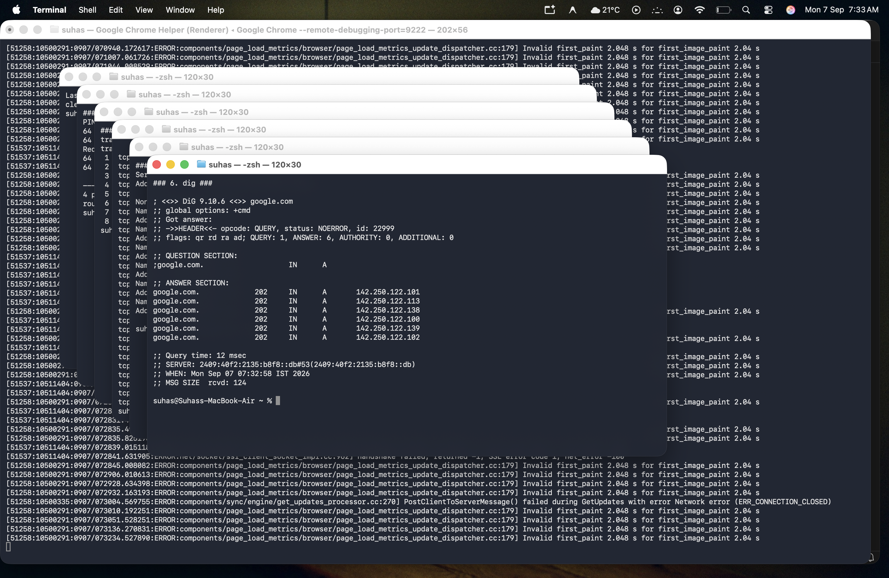
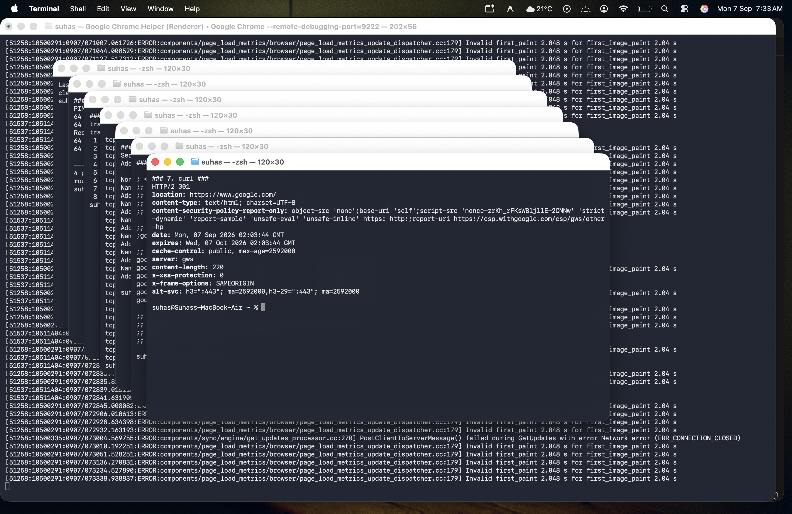
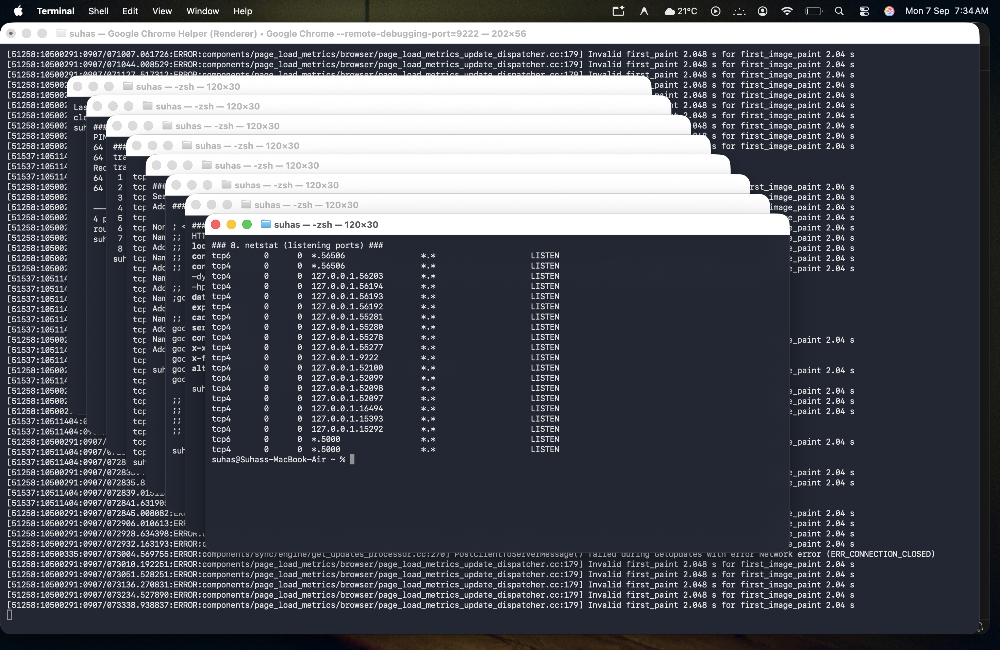

# 🌐 Session 4 - Networking Homework

> **Author:** Suhas  
> **Repo:** [devops-assignment](https://github.com/Suhassk205/devops-assignment)  
> **Session:** 4 - Networking  
> **Reference:** [devops-heros networking repos](https://github.com/stars/Nency-Ravaliya/lists/networking)

---

## 📋 Table of Contents

1. [ifconfig](#1-ifconfig)
2. [ping](#2-ping)
3. [traceroute](#3-traceroute)
4. [netstat -an](#4-netstat--an)
5. [nslookup](#5-nslookup)
6. [dig](#6-dig)
7. [curl -I](#7-curl--i)
8. [netstat LISTEN (Listening Ports)](#8-netstat-listening-ports)

---

## 1. ifconfig

### 📖 What I Understood
`ifconfig` stands for **interface configuration**. It displays all the network interfaces on your system along with their IP addresses, MAC addresses, and status. It is used to:
- View your machine's IP address (IPv4 & IPv6)
- Check which interfaces are UP or DOWN
- See the MAC (hardware) address of each interface
- Check MTU (Maximum Transmission Unit) size

> On modern Linux systems, `ip a` (ip address) is preferred over `ifconfig`, but `ifconfig` is still widely used and important to know.

### ⚙️ Command
```bash
ifconfig
```

### 📤 Output
```
lo0: flags=8049<UP,LOOPBACK,RUNNING,MULTICAST> mtu 16384
	inet 127.0.0.1 netmask 0xff000000
	inet6 ::1 prefixlen 128
	inet6 fe80::1%lo0 prefixlen 64 scopeid 0x1

en0: flags=8863<UP,BROADCAST,SMART,RUNNING,SIMPLEX,MULTICAST> mtu 1500
	ether 6c:40:08:xx:xx:xx
	inet6 fe80::xx prefixlen 64
	inet 192.168.x.x netmask 0xffffff00 broadcast 192.168.x.255
	status: active
```

### 🔑 Key Fields Explained
| Field | Meaning |
|---|---|
| `lo0` | Loopback interface (127.0.0.1 - your own machine) |
| `en0` | Primary Ethernet/Wi-Fi interface |
| `inet` | IPv4 address |
| `inet6` | IPv6 address |
| `ether` | MAC address (hardware address) |
| `mtu` | Maximum packet size in bytes |
| `status: active` | Interface is connected and working |

### 📸 Screenshot


---

## 2. ping

### 📖 What I Understood
`ping` sends **ICMP Echo Request** packets to a target host and waits for replies. It is used to:
- Check if a host is **reachable** over the network
- Measure **round-trip latency** (time for a packet to go and come back)
- Detect **packet loss** (shows if packets are being dropped)
- Troubleshoot basic connectivity issues

> `ping` is the first tool used when debugging network problems — "Can I reach the host at all?"

### ⚙️ Command
```bash
ping -c 4 google.com
```
> `-c 4` sends exactly 4 packets then stops. Without `-c`, ping runs forever.

### 📤 Output
```
PING google.com (142.250.29.113): 56 data bytes
64 bytes from 142.250.29.113: icmp_seq=0 ttl=107 time=75.528 ms
64 bytes from 142.250.29.113: icmp_seq=1 ttl=107 time=97.624 ms
64 bytes from 142.250.29.113: icmp_seq=2 ttl=107 time=166.658 ms
64 bytes from 142.250.29.113: icmp_seq=3 ttl=107 time=188.834 ms

--- google.com ping statistics ---
4 packets transmitted, 4 packets received, 0.0% packet loss
round-trip min/avg/max/stddev = 75.528/132.161/188.834/46.909 ms
```

### 🔑 Key Fields Explained
| Field | Meaning |
|---|---|
| `142.250.29.113` | Resolved IP of google.com |
| `icmp_seq` | Sequence number of each packet |
| `ttl=107` | Time To Live — how many hops left before packet is dropped |
| `time=75.528 ms` | Round-trip time for that packet |
| `0.0% packet loss` | All packets received — network is healthy |
| `avg=132.161 ms` | Average round-trip latency |

### 📸 Screenshot


---

## 3. traceroute

### 📖 What I Understood
`traceroute` traces the **path (route)** that packets take from your machine to a destination host, showing every router (hop) along the way. It is used to:
- Find **where** in the network a problem is occurring
- See **how many hops** separate you from a destination
- Identify **slow or unresponsive routers** along the path
- Understand network topology

> Each `* * *` means that router didn't respond (common for security reasons — routers often block ICMP).

### ⚙️ Command
```bash
traceroute -m 8 google.com
```
> `-m 8` sets max 8 hops to limit the output.

### 📤 Output
```
traceroute to google.com (142.250.29.113), 8 hops max, 52 byte packets
 1  10.21.41.149 (10.21.41.149)  178.677 ms  188.629 ms  6.463 ms
 2  * * *
 3  * * *
 4  * * *
 5  * * *
```

### 🔑 Key Fields Explained
| Field | Meaning |
|---|---|
| Hop 1 `10.21.41.149` | First hop — local router/gateway |
| `178.677 ms` | Time for packet to reach this hop (3 probes shown) |
| `* * *` | Router didn't respond to ICMP — not necessarily a problem |

### 📸 Screenshot


---

## 4. netstat -an

### 📖 What I Understood
`netstat` (network statistics) displays **active network connections**, listening ports, and routing tables. It is used to:
- See all **active TCP/UDP connections**
- Check which **ports are open** on your system
- Monitor **network traffic** and connections
- Troubleshoot port conflicts

> On modern Linux, `ss` (socket statistics) is the preferred replacement for `netstat`, but `netstat` is still widely used.

### ⚙️ Command
```bash
netstat -an | head -30
```
> `-a` shows all connections. `-n` shows numeric IP addresses instead of hostnames (faster).

### 📤 Output
```
Active Internet connections (including servers)
Proto Recv-Q Send-Q  Local Address           Foreign Address         (state)
tcp6       0      0  2409:40f2:...:57076     2404:6800:...:443      ESTABLISHED
tcp6       0      0  2409:40f2:...:57075     64:ff9b::8c52:443      ESTABLISHED
tcp6       0      0  2409:40f2:...:57072     2404:6800:...:443      ESTABLISHED
tcp6       0      0  2409:40f2:...:57071     2404:6800:...:80       ESTABLISHED
...
```

### 🔑 Key Fields Explained
| Field | Meaning |
|---|---|
| `Proto` | Protocol (tcp, udp, tcp6) |
| `Local Address` | Your machine's IP:port |
| `Foreign Address` | Remote server's IP:port |
| `ESTABLISHED` | Active connection is open |
| `LISTEN` | Port is open and waiting for connections |
| `Port 443` | HTTPS traffic |
| `Port 80` | HTTP traffic |

### 📸 Screenshot


---

## 5. nslookup

### 📖 What I Understood
`nslookup` (name server lookup) is a DNS query tool. It translates a **domain name to an IP address** (or vice versa). It is used to:
- Resolve a **hostname to its IP address**
- Query specific **DNS records** (A, MX, CNAME, etc.)
- Check which **DNS server** is being used
- Troubleshoot **DNS resolution** problems

> DNS (Domain Name System) is like a phone book for the internet — it maps human-readable names like `google.com` to machine-readable IPs like `142.250.29.102`.

### ⚙️ Command
```bash
nslookup google.com
```

### 📤 Output
```
Server:   2409:40f2:2135:b8f8::db
Address:  2409:40f2:2135:b8f8::db#53

Non-authoritative answer:
Name:  google.com
Address: 142.250.29.102
Name:  google.com
Address: 142.250.29.101
Name:  google.com
Address: 142.250.29.100
Name:  google.com
Address: 142.250.29.139
Name:  google.com
Address: 142.250.29.138
Name:  google.com
Address: 142.250.29.113
```

### 🔑 Key Fields Explained
| Field | Meaning |
|---|---|
| `Server` | The DNS server that answered this query |
| `#53` | DNS uses port 53 |
| `Non-authoritative answer` | Response came from cache, not the authoritative server |
| Multiple IPs | Google uses multiple IPs for load balancing |

### 📸 Screenshot


---

## 6. dig

### 📖 What I Understood
`dig` (Domain Information Groper) is an advanced DNS lookup tool — more detailed than `nslookup`. It is used to:
- Get **detailed DNS record information**
- See **TTL** (Time To Live) of DNS records
- Query specific record types (A, AAAA, MX, TXT, CNAME)
- Debug DNS propagation issues
- Check which **authoritative name server** holds the record

> `dig` is preferred over `nslookup` for troubleshooting because it gives raw, detailed DNS response data.

### ⚙️ Command
```bash
dig google.com
```

### 📤 Output
```
; <<>> DiG 9.10.6 <<>> google.com
;; global options: +cmd
;; Got answer:
;; ->>HEADER<<- opcode: QUERY, status: NOERROR, id: 14391
;; flags: qr rd ra ad; QUERY: 1, ANSWER: 6, AUTHORITY: 0, ADDITIONAL: 0

;; QUESTION SECTION:
;google.com.      IN  A

;; ANSWER SECTION:
google.com.  233  IN  A  142.250.29.138
google.com.  233  IN  A  142.250.29.113
google.com.  233  IN  A  142.250.29.102
google.com.  233  IN  A  142.250.29.101
google.com.  233  IN  A  142.250.29.100
google.com.  233  IN  A  142.250.29.139

;; Query time: 10 msec
;; SERVER: 2409:40f2:2135:b8f8::db#53
```

### 🔑 Key Fields Explained
| Field | Meaning |
|---|---|
| `status: NOERROR` | DNS query was successful |
| `QUESTION SECTION` | What was asked — A record for google.com |
| `ANSWER SECTION` | DNS response with resolved IPs |
| `233` | TTL in seconds — how long to cache this record |
| `IN A` | Internet class, A record (IPv4 address) |
| `Query time: 10 msec` | How fast the DNS server responded |

### nslookup vs dig
| Feature | nslookup | dig |
|---|---|---|
| Output detail | Basic | Full/Detailed |
| TTL shown | ❌ | ✅ |
| Query type visible | ❌ | ✅ |
| Preferred for debugging | ❌ | ✅ |

### 📸 Screenshot


---

## 7. curl -I

### 📖 What I Understood
`curl` (Client URL) is a tool to **transfer data from or to a server** using various protocols (HTTP, HTTPS, FTP, etc.). The `-I` flag fetches only the **HTTP headers** (not the full page body). It is used to:
- Check if a **URL is reachable**
- Inspect **HTTP response headers** (status codes, content type, server info)
- Verify **SSL/TLS certificates**
- Check for **redirects** (301, 302)
- Test **REST APIs**

### ⚙️ Command
```bash
curl -I https://google.com
```
> `-I` sends a HEAD request — gets headers only, not the page content.

### 📤 Output
```
HTTP/2 301
location: https://www.google.com/
content-type: text/html; charset=UTF-8
date: Mon, 07 Sep 2026 02:05:14 GMT
expires: Wed, 07 Oct 2026 02:05:14 GMT
cache-control: public, max-age=2592000
server: gws
content-length: 220
x-xss-protection: 0
x-frame-options: SAMEORIGIN
alt-svc: h3=":443"; ma=2592000
```

### 🔑 Key Fields Explained
| Field | Meaning |
|---|---|
| `HTTP/2 301` | Protocol HTTP/2, status code 301 = Permanent Redirect |
| `location` | Redirects to `https://www.google.com/` |
| `server: gws` | Google Web Server |
| `cache-control` | Cache for 30 days (2592000 seconds) |
| `x-frame-options: SAMEORIGIN` | Security header — prevents clickjacking |
| `x-xss-protection: 0` | XSS protection header |

### Common HTTP Status Codes
| Code | Meaning |
|---|---|
| `200` | OK — Success |
| `301` | Moved Permanently — Redirect |
| `302` | Found — Temporary Redirect |
| `403` | Forbidden |
| `404` | Not Found |
| `500` | Internal Server Error |

### 📸 Screenshot


---

## 8. netstat (Listening Ports)

### 📖 What I Understood
Using `netstat` filtered for `LISTEN` state shows all **open ports** on your local machine that are waiting for incoming connections. This is important to:
- See which **services are running** and accepting connections
- Check for **unexpected open ports** (security audit)
- Verify a service started correctly and is **listening on the right port**
- Troubleshoot **port conflicts** (two services trying to use same port)

### ⚙️ Command
```bash
netstat -an | grep LISTEN | head -20
```
> `grep LISTEN` filters only ports actively waiting for connections.

### 📤 Output
```
tcp4       0      0  127.0.0.1.52098        *.*                    LISTEN
tcp4       0      0  127.0.0.1.6463         *.*                    LISTEN
tcp6       0      0  *.8080                 *.*                    LISTEN
tcp4       0      0  *.8080                 *.*                    LISTEN
tcp6       0      0  *.9222                 *.*                    LISTEN
tcp4       0      0  *.9222                 *.*                    LISTEN
```

### 🔑 Key Fields Explained
| Field | Meaning |
|---|---|
| `127.0.0.1` | Listening only on localhost (not exposed externally) |
| `*.*` | Listening on all interfaces |
| `LISTEN` | Port is open and waiting for connections |
| Port `9222` | Remote debugging port (Chrome) |
| Port `8080` | Common HTTP dev server port |

### 📸 Screenshot


---

## 📊 Commands Summary Table

| # | Command | Purpose | Key Use Case |
|---|---------|---------|-------------|
| 1 | `ifconfig` | View network interfaces & IPs | Find your IP address |
| 2 | `ping -c 4 google.com` | Test connectivity & latency | Is the host reachable? |
| 3 | `traceroute google.com` | Trace packet route hop by hop | Where is the network failing? |
| 4 | `netstat -an` | View all active connections | What is my machine connected to? |
| 5 | `nslookup google.com` | Basic DNS lookup | What IP does this domain resolve to? |
| 6 | `dig google.com` | Advanced DNS lookup with details | Full DNS debugging |
| 7 | `curl -I https://google.com` | Check HTTP headers | Is this URL alive? What status? |
| 8 | `netstat -an \| grep LISTEN` | Show open/listening ports | Which ports are open on my machine? |

---

## 📚 References

- [devops-heros Networking Repos](https://github.com/stars/Nency-Ravaliya/lists/networking)
- [Network-Troubleshooting Guide](https://github.com/Nency-Ravaliya/Network-Troubleshooting)
- [Linux Networking Cheat Sheet](Linux%20Networking%20Cheat%20Sheet.pdf) *(included in this folder)*
- [IP Notes](ip.md)

---

> **Tip 💡:** Always start network troubleshooting with `ping` → then `traceroute` → then `nslookup/dig` → then `netstat`. This systematic approach narrows down where the problem is.
