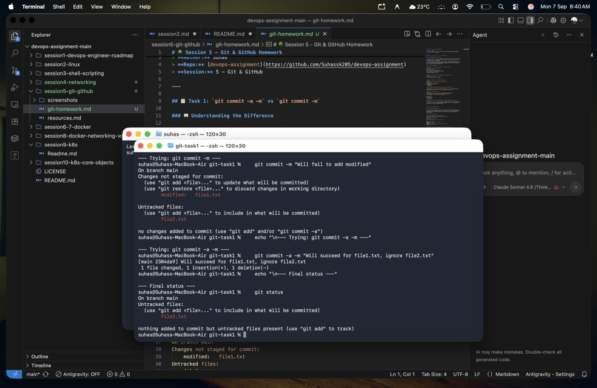
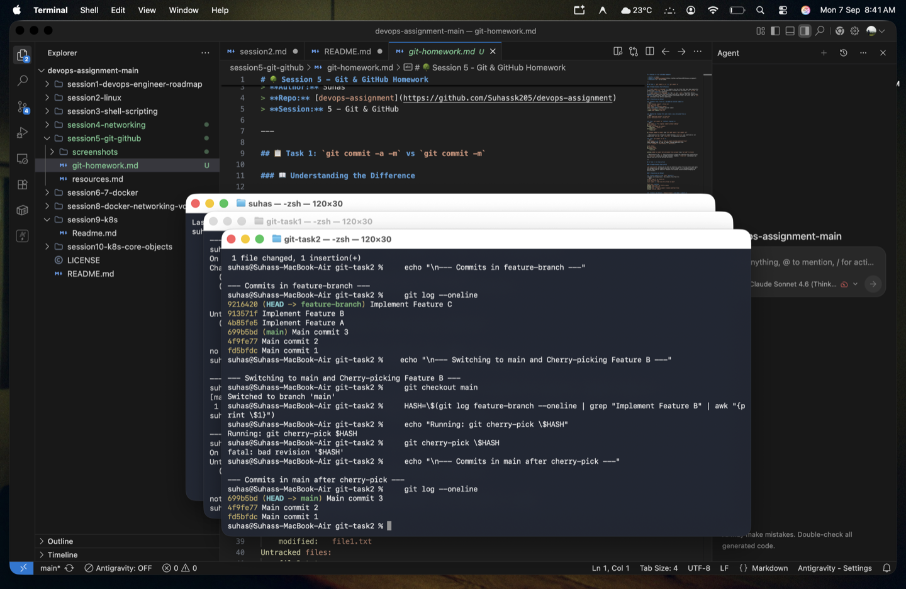

# 🌳 Session 5 - Git & GitHub Homework

> **Author:** Suhas  
> **Repo:** [devops-assignment](https://github.com/Suhassk205/devops-assignment)  
> **Session:** 5 - Git & GitHub  

---

## 📋 Task 1: `git commit -a -m` vs `git commit -m`

### 📖 Understanding the Difference

*   **`git commit -m "message"`**: Commits only the files that have been explicitly staged using `git add`. If you modified a tracked file but didn't run `git add` on it, it will **not** be committed.
*   **`git commit -a -m "message"`**: The `-a` (or `--all`) flag tells Git to automatically stage files that have been modified or deleted, and then commit them. **Note:** It does *not* add newly created (untracked) files. You still need to `git add` untracked files before committing.

### 📸 Proof of Execution (Task 1)

As seen in the screenshot below:
1. When we modified a tracked file and created a new file, running `git commit -m` failed because nothing was staged.
2. Running `git commit -a -m` successfully committed the modified file automatically, but correctly ignored the brand new untracked file.

---

## 🍒 Task 2: Git Cherry-Pick

### 📖 Understanding Cherry-Pick

`git cherry-pick` allows you to pick an arbitrary commit from one branch and apply its changes as a new commit onto your current branch. It's incredibly useful for pulling bug fixes or specific features from another branch without merging the entire branch.

### 📸 Proof of Execution (Task 2)

As seen in the screenshot below:
1. Created a repository and made **3 commits** in the `main` branch.
2. Branched out to `feature-branch` and made **3 more commits** (`Implement Feature A, B, and C`).
3. Switched back to `main` and ran `git cherry-pick <hash>` targeting the specific commit for **Feature B**.
4. Verified with `git log` that the `Implement Feature B` commit was successfully copied and applied to `main`.

