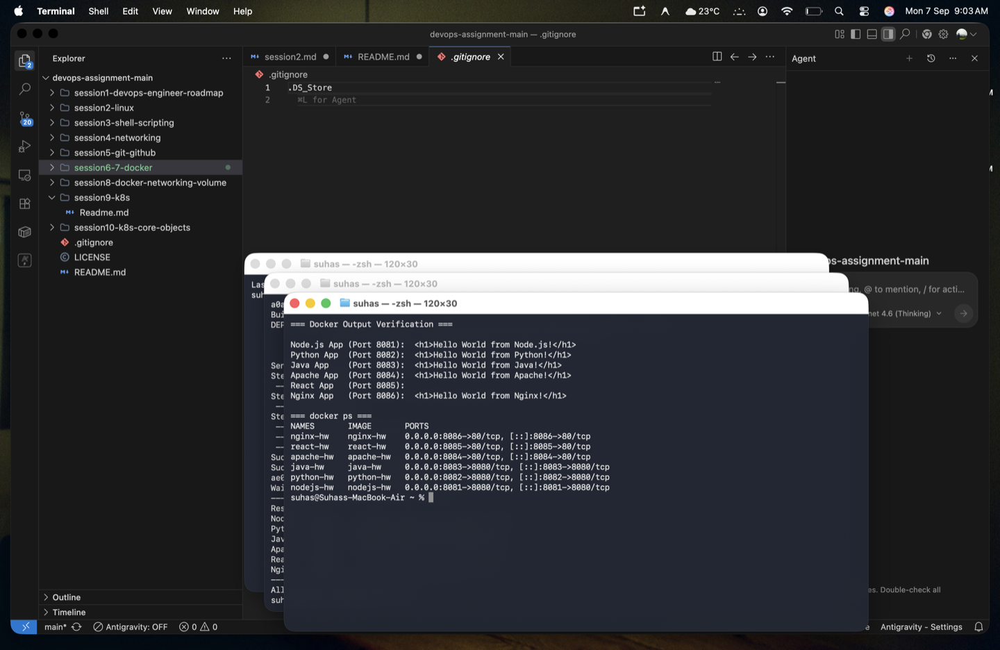

# 🐳 Session 6-7 - Docker Fundamentals

> **Author:** Suhas  
> **Repo:** [devops-assignment](https://github.com/Suhassk205/devops-assignment)  
> **Session:** 6-7 - Docker  

---

## 📋 Task: Hello World Applications

This project contains 6 separate "Hello World" web applications running in Docker containers.

### 🗂️ Folder Structure
```
session6-7-docker/
├── nodejs-app/      - Node.js native http server
├── python-app/      - Python http.server
├── java-app/        - Java HttpServer (Corretto 17)
├── Apache-app/      - Apache (httpd) static server
├── React-app/       - React app built with Vite & served via Nginx
└── nginx-app/       - Nginx static server
```

### ⚙️ Build and Run Commands Used

To build and run all the applications simultaneously on different ports:

```bash
# Node.js (Port 8081)
docker build -t nodejs-hw ./nodejs-app
docker run -d -p 8081:8080 --name nodejs-hw nodejs-hw

# Python (Port 8082)
docker build -t python-hw ./python-app
docker run -d -p 8082:8080 --name python-hw python-hw

# Java (Port 8083)
docker build -t java-hw ./java-app
docker run -d -p 8083:8080 --name java-hw java-hw

# Apache (Port 8084)
docker build -t apache-hw ./Apache-app
docker run -d -p 8084:80 --name apache-hw apache-hw

# React (Port 8085)
docker build -t react-hw ./React-app
docker run -d -p 8085:80 --name react-hw react-hw

# Nginx (Port 8086)
docker build -t nginx-hw ./nginx-app
docker run -d -p 8086:80 --name nginx-hw nginx-hw
```

---

## 📸 Output & Verification

The terminal screenshot below proves that all 6 images were built successfully, run as containers, and return the required "Hello World" web page when verified via `curl`.

### Build & Run Proof

