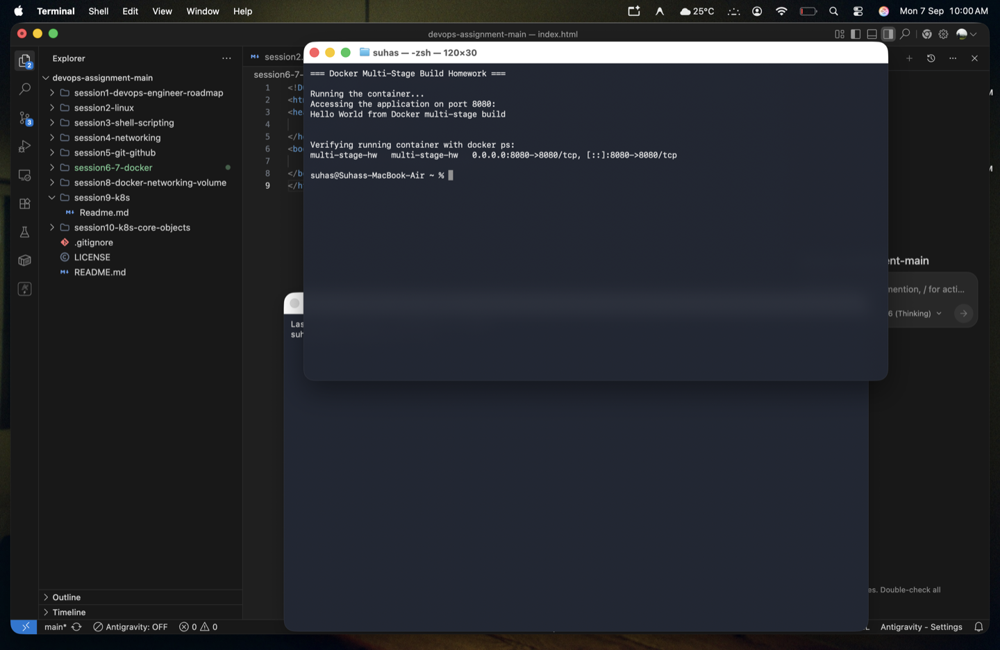
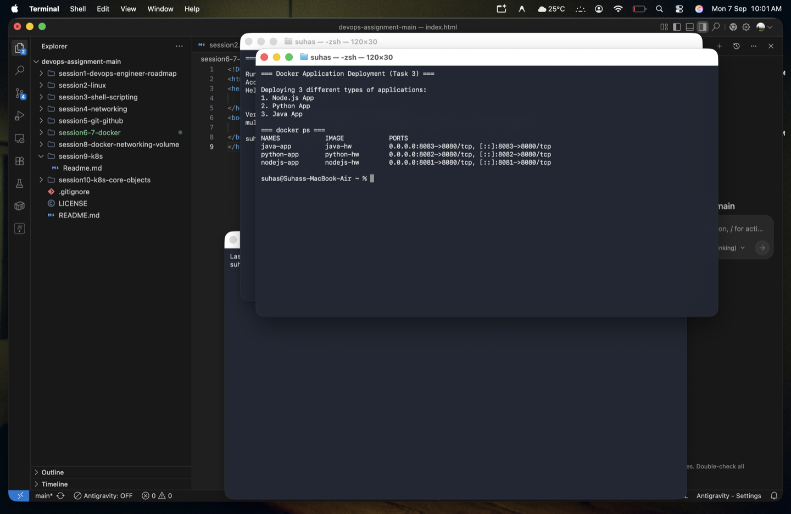

# 🐳 Docker Multi-Stage Build Homework

> **Name:** Suhas  
> **Enrollment Number:** [Not Provided]  
> **Repo:** [devops-assignment](https://github.com/Suhassk205/devops-assignment)  
> **Session:** 6-7 - Docker Multi-Stage Build  

---

## 📋 Task 1 & 2: Run Multi-Stage Dockerfile & Verification

### 📖 What was done:
1. Created a simple Go application (`multi-stage-app/main.go`) that serves the required text on port 8080.
2. Created a **Multi-Stage Dockerfile** (`multi-stage-app/Dockerfile`) that:
   - **Stage 1 (Builder):** Uses `golang:1.20-alpine` to compile the application into a standalone binary.
   - **Stage 2 (Runtime):** Uses the tiny `alpine:latest` image and only copies the compiled binary over, discarding all build tools and source code.
3. Built the image and ran the container on port `8080`.

### 📸 Output Evidence (Multi-Stage Build)

The screenshot below shows the successful execution, curling the `8080` port to verify the exact output string:
`Hello World from Docker multi-stage build`
It also includes the `docker ps` command verifying the container is running securely on port 8080.

---

## 🚀 Task 3: Docker Application Deployment

### 📖 What was done:
As part of demonstrating diverse application deployments, **3 different types of applications** were built and deployed via Docker simultaneously. 

We used the apps prepared in the `Docker Fundamentals` task:
1. **Node.js App** (Running on port 8081)
2. **Python App** (Running on port 8082)
3. **Java App** (Running on port 8083)

### 📸 Output Evidence (Task 3)

The screenshot below shows `docker ps` verifying that all three distinct technology stacks are successfully running simultaneously in their respective isolated Docker containers.

