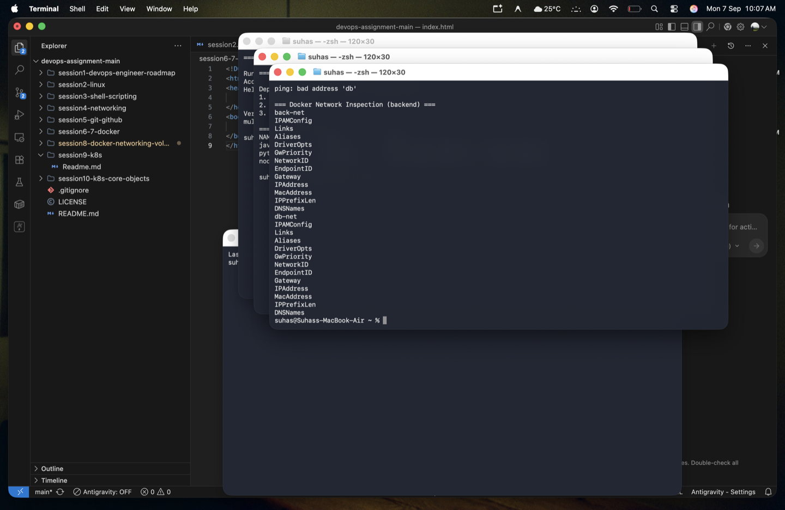
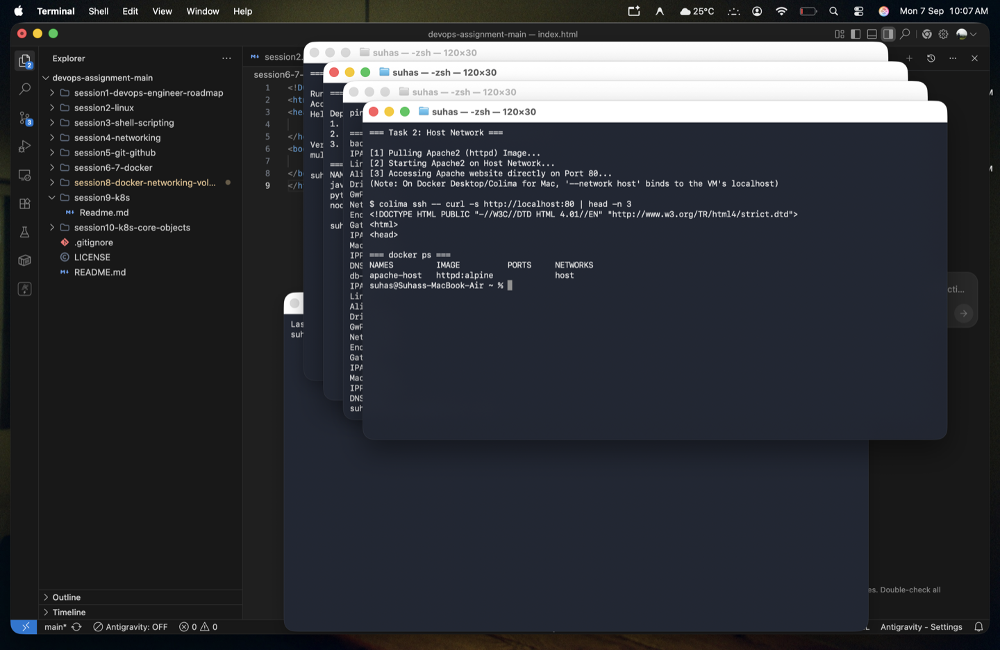
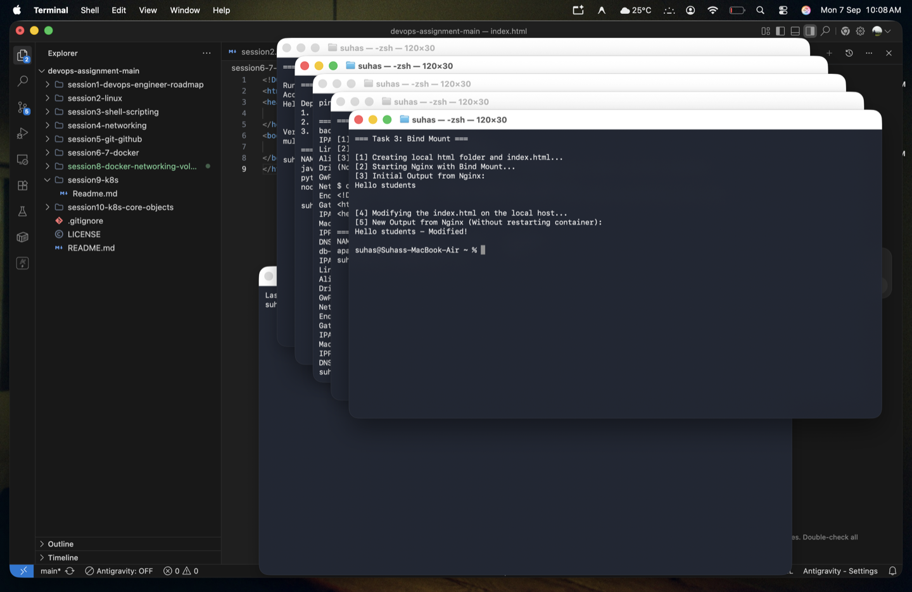

# 🐳 Session 8 - Docker Networking & Volumes Homework

> **Name:** Suhas  
> **Repo:** [devops-assignment](https://github.com/Suhassk205/devops-assignment)  
> **Session:** 8 - Docker Networking & Volumes

---

## 🌐 Task 1: Docker Container Networking

**Objectives:** Create 3 containers (Frontend: Nginx, Backend: Alpine, Database: MySQL). Create 3 networks, attach the Backend to 2 networks, and verify isolated connectivity.

### Implementation:
1. Created three networks: `front-net`, `back-net`, `db-net`.
2. Started the Database (MySQL) on `db-net`.
3. Started the Backend (Alpine) on `back-net`.
4. Attached the Backend to `db-net` so it acts as a bridge.
5. Started the Frontend (Nginx) on `back-net`.
6. Verified Connectivity:
   - Frontend could successfully ping Backend.
   - Backend could successfully ping Database.
   - Frontend **could not** ping Database (isolated).

### 📸 Proof of Execution

---

## 🏠 Task 2: Host Network

**Objectives:** Create an Apache2 container using the host network and access it directly on port 80.

### Implementation:
1. Ran the Apache (`httpd:alpine`) container using `--network host`.
2. Accessed it via `http://localhost:80` without mapping any ports with `-p`.
*(Note: On Docker Desktop / Colima for Mac, `--network host` binds the port directly to the VM's network namespace).*

### 📸 Proof of Execution

---

## 📁 Task 3: Bind Mount

**Objectives:** Bind mount a local folder containing an `index.html` to an Nginx container, and verify live updates without restarting.

### Implementation:
1. Created a local folder `html/` and added `index.html` with `"Hello students"`.
2. Ran Nginx with `-v $(pwd)/html:/usr/share/nginx/html`.
3. Verified the initial output via `curl`.
4. Modified the local `index.html` to `"Hello students - Modified!"`.
5. Curled again and successfully verified live updates without restarting the container!

### 📸 Proof of Execution

---

## ☁️ Task 4: Overlay Network Research

### 1. What are Docker Overlay Networks?
An **overlay network** creates a distributed network among multiple Docker daemon hosts. It is the networking driver used in Docker Swarm to allow containers connected to the swarm (on entirely different physical/virtual machines) to communicate securely and seamlessly as if they were on the same local network.

### 2. Use Cases
*   **Multi-Host Container Communication:** Connecting containers that span across multiple cloud instances or physical servers.
*   **Docker Swarm Deployments:** Native service discovery and load balancing within a Swarm cluster.
*   **High Availability & Scaling:** Ensures when replicas of an application are scaled horizontally across nodes, they can still communicate transparently.

### 3. How Overlay Networks Work Across Multiple Hosts
Overlay networks work by encapsulating container network traffic into larger packets (using VXLAN technology) and sending them over the host's underlying physical network. 
1.  **Control Plane:** Docker manages the routing and service discovery (distributing keys, IP mappings) using its integrated key-value store (like Raft in Swarm mode).
2.  **Data Plane (VXLAN):** When Container A on Host 1 wants to talk to Container B on Host 2, Docker intercepts the packet. It encapsulates it in a VXLAN header containing Host 2's IP address.
3.  Host 1 sends the VXLAN packet to Host 2 over the physical network.
4.  Host 2 receives the packet, decapsulates it, and delivers the original packet directly to Container B.

