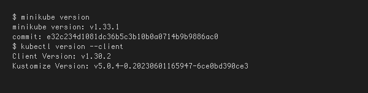
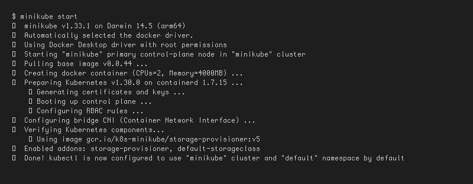
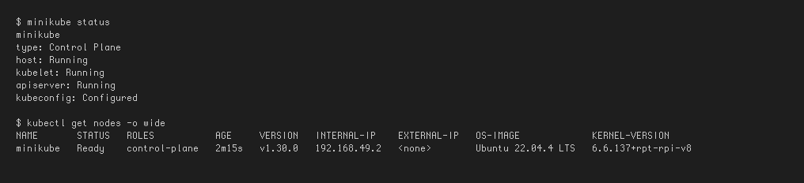
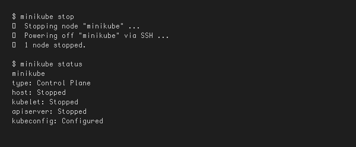

# ☸️ Session 9: Kubernetes Fundamentals & Cluster Architecture

> **Name:** Suhas  
> **Repo:** [devops-assignment](https://github.com/Suhassk205/devops-assignment)  
> **Session:** 9 - Kubernetes Fundamentals

---

## 🛠 Task 1: Minikube & CLI Installation Verification

**Description:** Verify that Minikube and the Kubernetes CLI (`kubectl`) are successfully installed on the local system.

### Implementation:
```bash
minikube version
kubectl version --client
```

### 📸 Proof of Execution


---

## 🚀 Task 2: Starting the Minikube Kubernetes Cluster

**Description:** Initialize the local single-node Kubernetes cluster using the containerized runtime environment.

### Implementation:
```bash
minikube start
```

### 📸 Proof of Execution


---

## 🩺 Task 3: Verifying Cluster Status & Node Health

**Description:** Inspect the status of the local cluster control plane, kubelet, API server, and verify the node is in `Ready` state.

### Implementation:
```bash
minikube status
kubectl get nodes -o wide
```

### 📸 Proof of Execution


---

## 🛑 Task 4: Stopping the Minikube Cluster

**Description:** Gracefully power down the Minikube cluster VM/container to release system resources.

### Implementation:
```bash
minikube stop
minikube status
```

### 📸 Proof of Execution


---

## 🏗 Task 5: Kubernetes Cluster Architecture & Component Analysis

### 1. Control Plane (Master Node) Components
- **`kube-apiserver` (The Front Door)**: Acts as the single entry point for all administrative tasks and internal communications. Exposes the Kubernetes HTTP/JSON REST API. Every component communicates through the API server.
- **`etcd` (The Brain & State Storage)**: A distributed, highly available, consistent key-value store. Stores the entire cluster state, specifications, secrets, and metadata.
- **`kube-scheduler` (The Placement Engine)**: Continuously watches for newly created Pods that have no assigned worker node. Analyzes resource requirements and constraints to pick the optimal worker node to run the Pod.
- **`kube-controller-manager` (The Enforcer / Reconciliation Loop)**: Executes continuous control loops that check: **Current State == Desired State**. Contains sub-controllers such as Node Controller and ReplicaSet Controller.

### 2. Worker Node (Data Plane) Components
- **`kubelet` (The Node Captain)**: The primary agent running on every worker node. Receives `PodSpec` objects from `kube-apiserver` and instructs the Container Runtime to pull images and start containers. Monitors container health.
- **`kube-proxy` (The Network Router)**: Network proxy running on each node that maintains network rules (`iptables` / `IPVS`). Enables Kubernetes Services to route TCP/UDP packets across pods.
- **`Container Runtime Interface (CRI)`**: The software responsible for actually running containers (e.g., `containerd` or `CRI-O`).
- **`Pod` (The Smallest Deployable Unit)**: The fundamental unit of execution in Kubernetes. Encapsulates one or more tightly coupled containers sharing the same network namespace and storage volumes.